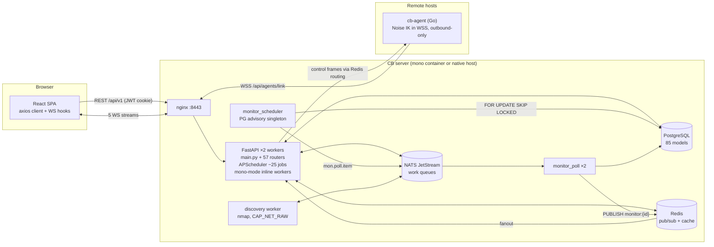

# Circuit Breaker — Architecture Assessment

**Date:** 2026-08-30 · **Branch:** `dev` @ `52364918` · **Assessor:** evidence-driven static review (5 parallel read-only code audits + targeted verification)

---

## 1. Executive conclusion

**Verdict: Yes, with targeted changes.** The current architecture is fit for continued development, and the remote-agent feature does not need to be built — it already exists and is the best-engineered subsystem in the repository. What is needed is (a) closing a short list of P1 security/reliability gaps, (b) restoring the internal layering the codebase claims but no longer follows, and (c) establishing a performance baseline before any optimization or extraction.

**The three most important reasons:**

1. **The remote-agent capability is already implemented to a high standard.** A separate Go agent binary (`apps/agent`, 94 files) speaks a versioned, typed, closed frame vocabulary over Noise IK nested inside outbound-only WSS, with hashed single-use pairing enrollment, double-ended capability/scope enforcement, spooled at-least-once delivery with idempotent ingest, crash-safe self-update with automatic rollback, and cross-language conformance corpora gated in CI. No P0 gap was found in it. The control-plane-in-monolith + independent agent binary split is exactly the architecture this assessment would otherwise have recommended building.
2. **The process/runtime architecture is right-sized; the code-level boundaries are not.** Deployment topology (supervisord process tree, JetStream work queues, Postgres advisory-lock singletons, Redis fanout) is well matched to self-hosted scale and needs no extraction. But the stated internal architecture ("routes stay thin; services hold logic") is violated at scale: 246 direct DB accesses across 27 of 58 API files, a 718-line route function, an 85-model/2,846-line `db/models.py` imported by 127 files, `core/` reaching down into `services/` in 12 modules, and an 1,103-line startup function holding ~25 inline business-logic jobs. This is modularization-in-place work, not restructuring.
3. **The material risks are specific, local, and fixable without architectural change:** air-gap enforcement is per-callsite and provably incomplete (CVE sync calls NVD with zero checks); backup tarballs carry the plaintext Fernet vault key and are uploaded to S3; agent binaries are unsigned and the agent TLS pin cannot be rotated (fleet-stranding); and the deb/rpm packaged install starts no monitor workers, so the monitoring engine silently never runs on that topology.

**Recommended posture:** retain and refactor the **modular monolith**; keep the **existing separate agent binary** and its protocol; extract **nothing** now. Define explicit triggers (§8) under which the agent link-plane or discovery worker would later become separate deployables.

---

## 2. Evidence and scope

| Item | Value |
|---|---|
| Commit / branch | `52364918` on `dev` ("feat(verification): a Tier 3 run has to say which artifact it is talking about") |
| Date of review | 2026-08-30 |
| Method | Read-only static analysis: file reads, grep/AST scans, manifest inspection. Five parallel audit passes (inventory, flow traces, remote-agent, boundaries/delivery, performance/security) followed by direct verification of the highest-stakes claims. |
| Not done | No application execution, no tests run, no load testing, no dynamic profiling, no dependency-vulnerability scan. No files modified except the creation of this report. |
| Working-tree note | Uncommitted modifications exist (skills, packaging, build tests); the review reflects the checked-out tree. |

**Labels used throughout:** **Verified** (code/config read directly), **Strongly indicated** (pattern confirmed, impact inferred), **Hypothesis**, **Needs measurement**. All runtime-performance impact claims are Needs measurement unless stated otherwise — no baseline exists (§7).

Key limitation: with ~85k lines of backend Python, ~100k of frontend JS/JSX, and ~36k of Go, the audits sampled deeply rather than exhaustively; per-file counts (e.g., "246 direct DB accesses") come from mechanical grep/AST scans and are reproducible, while judgments about semantic duplication are labeled accordingly.

---

## 3. Current-state architecture map

### Components and ownership (Verified from manifests and process configs)

| Component | Tech | Entry point | Runs as |
|---|---|---|---|
| API server | FastAPI 0.135 / Python 3.12, uvicorn ×2 workers | `apps/backend/src/app/main.py` (2,519 lines) via `start.py` | `backend-api` under supervisord (mono) / systemd (native) |
| Background workers | Same codebase, `python -m app.workers.main --type=X` | `workers/main.py` dispatch: discovery, notification, telemetry, monitor_scheduler, monitor_poll ×2, monitor_probe_dispatch | 6 supervisord programs (mono); `circuitbreaker-worker@.service` (install.sh layout); **none in deb/rpm packages (F5)** |
| In-process work | APScheduler `SingleOwnerScheduler` (~25–30 jobs, PG-advisory-locked) + mono-mode asyncio loops (notifications, discovery, telemetry_ingest, integrations — `core/topology.py:82`) | `main.py` lifespan | Inside the API process |
| Remote agent | Go 1.25, static binaries (amd64/arm64), flynn/noise + gorilla/websocket | `apps/agent/cmd/cb-agent` | Hardened systemd unit on remote hosts, user `cb-agent`, outbound-only |
| Frontend | React 18 + Vite 7, JSX (no TS), ReactFlow topology, axios client | `apps/frontend/src` (441 files) | Static assets served by nginx |
| PostgreSQL 15/16 | Embedded (mono) or external via `CB_DB_URL`; pgbouncer :6432 transaction pooling when embedded | ~114 Alembic migrations | supervisord / external |
| Redis 7 | Cache, WS pub/sub fanout, session cache, agent control-frame routing, enrollment rate limits | `core/redis.py` (pool 250) | Loopback, 128MB LRU, no persistence |
| NATS 2.10 + JetStream | Work queues (MONITOR_POLL, MONITOR_PROBE, TELEMETRY), internal events (~40 subjects in `core/subjects.py`) | `core/nats_client.py` | Token-auth mandatory (mono) |
| nginx | TLS termination :8080/:8443, security headers, WS proxying | `docker/nginx.mono.conf` | supervisord |

### Deployment topologies (Verified)

1. **Mono Docker image** (primary container path): everything above in one container, single `/data` volume, root entrypoint fixes ownership then drops to `breaker:1000`.
2. **Native systemd via `install.sh`/`deploy/setup.sh`**: 12 units incl. worker template + `cb-helperd`; called "the primary install method" in `security.yml:187`.
3. **deb/rpm/apk/AppImage/pacman** (`nfpm.yaml`, `packaging/`): single unit, single process — see finding F5.
4. **Proxmox LXC** helper script; **legacy multi-container compose** files still present but no longer wired to the root compose (F21).

### Data flow

**Trust boundaries:** browser↔API (JWT cookie + CSRF double-submit); agent↔API (Noise IK mutual auth inside TLS, capability grants + scope evaluator on both ends); API↔external IdPs/NVD/SMTP (outbound; air-gap enforcement incomplete — F1); admin↔install script (unauthenticated by design, public material only).

---

## 4. Critical-flow traces

Condensed; full hop-by-hop citations were verified against the tree.

### 4.1 Authentication (Verified)

Login: SPA PBKDF2-hashes the password client-side → `POST /auth/login` (`api/auth.py:291`, rate-limited 5/min) → `auth_service.login()` (`services/auth_service.py:1037`): constant-time bcrypt with dummy-hash on unknown user, lockout, session row with `FOR UPDATE` concurrency cap → HS256 JWT (24h default, no refresh token) returned in body **and** HttpOnly `cb_session` cookie + JS-readable `cb_csrf` (`core/auth_cookie.py:38`). Per-request: central resolver `core/security.py:476` (10s session cache → revocation-table check → JWT decode → fallbacks including an **O(n) salted-hash scan of all `APIToken` rows** on unrecognized tokens, `security.py:563`). RBAC: 4-role hierarchy + `action:resource` scopes (`core/rbac.py`), enforced globally at router mount (`main.py:1756`) plus per-router/handler gates. **Drift:** ≥4 token-minting paths exist (login service, invite route, demo route, OAuth), and the in-code B28 comment (`api/auth.py:130-144`) documents that tokens minted without a session row are unrevocable until expiry — this divergence has already bitten once (F11).

### 4.2 Primary CRUD — hardware + topology edges (Verified)

The convention works where followed: `api/hardware.py:39` is thin (Pydantic schema → `require_write_auth` → `hardware_service.create_hardware` → audit row). Its sibling does not follow it: `api/graph.py` performs edge CRUD directly in routes (`graph.py:224-295`, `db.get`/`db.delete`/`db.commit`, no service, no event) and `build_topology_graph` (`graph.py:327`) is a **718-line route function issuing ~40 queries**. Cable edges publish NATS `topology.cable.added` best-effort; generic graph edges publish nothing — two inconsistent mutation paths for the same domain concept (F6).

### 4.3 Real-time — telemetry WS (Verified)

`useTelemetryStream.js` → nginx WS upgrade → `api/ws_telemetry.py:190`: cookie-or-first-message JWT (10s timeout), revocation + user checks against a hand-opened `SessionLocal()` **on the event loop**, CIDR allowlist, caps (100 global / 10 per-IP / 200 subscriptions) → per-connection Redis pub/sub listener forwards `telemetry:{id}` frames. Backpressure = disconnect (no send queue). Publishers: NATS JetStream `telemetry.ingest.>` consumer → batch insert → Redis publish. All five `ws_*.py` endpoints share low-level helpers but **each reimplements ~150 lines of registry/auth/ping/listener loop**, and `ws_monitors.py` hand-rolls its own raw `jwt.decode` path (F10).

### 4.4 Background job — monitor polling (Verified; the strongest backend flow)

`monitor_scheduler` (separate process, PG advisory lock makes exactly one active) claims due items with `FOR UPDATE SKIP LOCKED` (`services/monitoring/scheduler.py:159`), advancing `next_due_at` atomically — all state in the DB, crash-resumable. Server-vantage → JetStream `mon.poll.item` (WorkQueue, max_age 300s); agent-vantage → `MonitorProbeRun` row + run_id only (**credentials never ride NATS**). `monitor_poll_worker`: durable pull consumer, `Semaphore(50)` + `to_thread`, collector crash → down-sample, batch nak on failure (at-least-once). Results funnel through one shared `result_service.process_results` for both local and remote probes (deliberate anti-drift) → Redis publish → `ws_monitors`. Gap: **nak-forever with no dead-letter** for a deterministically poison batch (F14).

### 4.5 Remote agent — enrollment → command → result (Verified)

See §6. Enrollment: unauthenticated WS `/api/agents/enroll` → Noise IK handshake → pending row + hashed single-use 60-bit pairing code (15-min TTL, Redis `GETDEL`) → admin approves by fingerprint comparison → default grant is host-telemetry only. Commands: closed typed vocabulary (`frame.go:61-78`) — no exec/shell frame exists; probes and discovery are bounded, scope-versioned contracts checked on **both** ends. Results: spool (64MiB, two-phase peek/commit) → strictly-increasing seq → size-capped parse → run-token triple match → idempotent insert.

### 4.6 Startup/shutdown (Verified)

`main.py` lifespan (lines 548–1652, **1,103 lines**): executor→32 threads, topology-mode resolution (contradiction = exit 1), `/data` write test, Alembic auto-migrate + schema assert, vault-key init (missing key with existing ciphertext = exit 1), Redis/NATS connect + `validate_core_dependencies` (production aborts on missing Redis/NATS unless degraded-mode flag), two NATS→WS bridges, ~25 APScheduler jobs registered **inline with real business logic in closures** (demo-user expiry, audit-partition DDL, Proxmox orchestration, vault rotation), conditional in-process daemons, mono-mode inline workers, readiness gate. Shutdown implements a documented drain protocol (stop events → 5s cooperative lease release → cancel). Startup ordering is genuinely careful; the problem is that it is one untestable megafunction (F9).

---

## 5. Findings register

Priorities: **P0** critical blocker · **P1** fix before/alongside next release milestone · **P2** planned refactor/hardening · **P3** lower-value improvement. Classification: V=Verified, SI=Strongly indicated, H=Hypothesis, NM=Needs measurement.

| ID | Finding | Class | Evidence | Impact | Likelihood | Pri | Recommended action |
|---|---|---|---|---|---|---|---|
| F1 | Air-gap enforcement is per-callsite and incomplete: CVE/NVD sync has zero airgap checks; no central egress gate | V | `services/cve_service.py` (0 airgap hits, verified by grep); scheduled at `main.py:1141`; checks exist only in `network_acl.py:95`, `update_check.py`, `threat_feed.py` | Violates the product's stated CB_AIRGAP invariant; silent phone-home in air-gapped sites | High (any operator enabling CVE sync then flipping airgap) | **P1** | Route all outbound HTTP through one egress helper (extend `core/url_validation.py`) that checks airgap centrally; add a build-policy test asserting no direct `httpx/requests` egress outside it |
| F2 | Backup tarball contains plaintext vault key + full `.env` and is uploaded to S3 | V | `services/backup/snapshot.py:5-10,221`; `db_backup.py:261-289` | S3 bucket compromise decrypts every stored credential | Medium | **P1** | Client-side encrypt the tarball (age/GPG passphrase) before upload; keep local-only tarballs as-is if documented |
| F3 | Agent binaries unsigned; update path trusts server absolutely; docker-group grant ⇒ root-equivalent on Docker hosts | V | `update.go:77-173` (SHA-256 only); spec 07-26 §2.6 records the decision; 08-05 design records symlink risk | Server compromise = fleet-wide code execution | Low likelihood, very high impact | **P1** | Add release-signing key verified by agent pre-swap (08-25 design already introduces GPG infra); make docker-group join opt-in at install |
| F4 | Agent TLS pin rotation unsolved — regenerating a self-signed cert strands every enrolled agent | V | Named unsolved gap in spec 08-14 §5; nothing in `link.go`/`config.go` handles a pin successor | Fleet-bricking on routine cert renewal | High over product lifetime | **P1** | Implement pin-successor delivery over the authenticated Noise channel (mirror the existing server-key-rotation pattern) as slice 1 of the 08-14 address-model spec |
| F5 | deb/rpm/apk packaged install starts no monitor workers → monitoring engine never runs on that topology | V | `packaging/circuit-breaker.service:26` (bare ExecStart, no `--worker-type`); `core/topology.py:82-87` excludes monitor_* from in-process; no packaging file sets worker units | Core feature silently dead on a supported install path | Certain on that topology | **P1** | Either add worker units to the packages, or make MONO mode supervise monitor workers as subprocesses, or gate the package release on this; add a package-contract test |
| F6 | Route-layer DB logic at scale: 246 direct DB accesses in 27/58 API files; `build_topology_graph` = 718-line route fn with ~40 queries | V | `api/graph.py:327` (40 sites), `discovery.py` (31), `metrics.py` (26), `agents.py` (25), `admin.py` (23) | Untestable logic, duplicated queries, contradicts stated architecture | Ongoing drag | **P2** | Ratchet, don't rewrite: forbid new direct DB access in api/ via a build-policy test with a frozen allowlist; migrate worst files (graph, discovery) opportunistically |
| F7 | Inverted layering: `core/` imports `services/` in ≥12 modules via deferred imports; annotated circular-import workarounds incl. a duplicated constant table | V | `core/security.py:487`, `core/scheduler.py:86`, `core/destructive_actions.py:10` (top-level), `services/discovery_safe.py:17` | Circular-by-construction layering; fragile imports | Ongoing | **P2** | Extract the two god-utilities being reached for (`settings_service.get_or_create_settings`, `log_service.write_log`) into `core`-legal modules; then ban `core→services` imports with a lint/build test |
| F8 | `db/models.py`: 85 models, 2,846 lines, no grouping, imported by 127 files — highest-fan-in module | V | Grep counts; zero section headers | Every model change touches a file half the backend depends on; merge-conflict magnet | Ongoing | **P2** | Mechanically split into `db/models/{domain}.py` re-exported from `db/models/__init__.py` (zero behavior change, preserves import paths) |
| F9 | `main.py` lifespan is 1,103 lines with ~25 inline scheduler-job closures containing business logic; main.py 2,519 lines total | V | `main.py:549-1652`; jobs at 884–1470; inline health endpoints 2162–2280 | Startup untestable; job logic untestable/undiscoverable | Ongoing | **P2** | Extract jobs to `app/jobs/*.py` registered via a manifest; extract startup phases to `app/startup/*.py`; keep ordering explicit |
| F10 | WS endpoints: 5 copies of ~150-line registry/auth/ping/listener loops; 4+ divergent auth handshakes (`ws_monitors` uses raw `jwt.decode`) | V | `ws_telemetry.py:206`, `ws_topology.py:266`, `ws_discovery.py:233`, `ws_monitors.py:225` | Security-critical drift risk; a fix in one stream misses the others | Medium | **P2** | One shared `ws_session` helper (auth handshake, caps, ping, Redis listener) adopted stream-by-stream; contract tests pin the handshake |
| F11 | ≥4 JWT-minting paths; documented B28 defect class (tokens without session rows are unrevocable) | V | `api/auth.py:129-145,272-279`, OAuth `_issue_jwt_and_redirect`, FastAPI-Users router at `main.py:1828` | Session-revocation bypass re-emerges each time a new path is added | Medium | **P2** | Single `issue_session(user, ...)` helper that always records the session row; delete/wrap the parallel FastAPI-Users JWT route |
| F12 | ~60 `async def` endpoints + all WS auth phases run sync psycopg2 sessions on the event loop; asyncpg engine exists but serves only FastAPI-Users (0 route usages) | V pattern / NM impact | `db/session.py:37-44` (authors' own comment), `api/agents.py:426`, `ws_telemetry.py:219`; `Depends(get_async_db)` count = 0 in api/ | Event-loop stalls under load; concentrates where queries scale with fleet size | NM | **P2** | Cheap fix first: convert offending `async def` routes to `def` (threadpool) unless they await; measure loop lag (§7) before any asyncpg migration |
| F13 | 107 `except: pass` silent exception swallows across the backend | V | Grep count (140 bare `pass`, 107 in except handlers) | Failure invisibility | Medium | **P2** | Ruff: enable `S110`/`B` family with a frozen-baseline allowlist; convert to logged/narrowed handlers opportunistically |
| F14 | No dead-letter/poison-message handling on JetStream consumers; deterministic failure naks forever | V | `telemetry_ingest_worker.py:272-280`, `monitor_poll_worker.py:149-153` (mitigated by 300s/1h max_age) | Monitoring-plane availability; invisible stuck work | Low-Medium | **P2** | Max-deliver + park-to-table (a `failed_messages` row + admin surface) on both consumers |
| F15 | CSP allows `script-src 'unsafe-inline'` | V | `nginx.mono.conf:182` + app-level CSP | One XSS ⇒ full session compromise despite otherwise strong headers | Low (DOMPurify present) | **P2** | Move to nonce/hash-based CSP |
| F16 | Redis is a fail-closed hard dependency for the whole agent plane (enrollment caps, pairing, presence, control routing, update queue) | V | `agent_enrollment.py:138-175` (fail-closed by design) | Redis blip = fleet offline until it returns | Low (loopback Redis) | **P2** | Keep fail-closed for enrollment; consider a short grace window for *re*-connections of already-active agents; document the coupling |
| F17 | `agent_events` (approvals, capability grants) sits outside the hash-chained audit log; only revoke/delete write chained rows | V | Writers in `agent_registry.py` vs `core/audit_chain.py` | DB-write attacker can rewrite agent authorization history untraced | Low | **P2** | Mirror authorization-decision events into the chained `Log` |
| F18 | No performance baseline or load test exists anywhere; OTel off by default | V | `tests/` has no load suite; `artifacts/synthetic/` is packages | All performance decisions are currently guesses | — | **P2** | Build the fleet simulator + measurement plan in §7 before optimizing anything |
| F19 | Pre-push gate skips the 2,758-test backend suite (`CB_VERIFY_BACKEND=off`); pytest.ini documents a latent e2e-mark collection failure | V | `Makefile:316-317`, `.husky/pre-push`, pytest.ini markers section | Regressions land on dev, caught only in CI | Accepted tradeoff | **P3** | Keep (speed is a feature); fix the documented latent collection failure; consider a `verify-full` requirement before release tags |
| F20 | Lazy-loading N+1 risk: 7 eager-load usages vs 92 relationships; 66 query-in-loop sites; `search.py:35` runs 7 unanchored ILIKE scans per call; rollup/retention jobs are O(items) with Python-side aggregation | V pattern / NM impact | `api/services.py:307`, `hardware_service.py:583`, `rollup_worker.py:21-43`, `retention.py:113-159` | Read-path latency growth with entity count | NM | **P3** | Confirm with query-count instrumentation (§7) before touching; fix the confirmed top offenders only |
| F21 | Repo/deploy hygiene drift: legacy multi-container Dockerfiles and a `cb` compose mode still present; two native layouts with different users/paths; `packaging/systemd/` naming traps; session exhaust at root (plans/, SECURITY_REPORTS/, known_bugs-v1.0.0-rc.1.md vs VERSION 0.4.0); duplicated hook stacks (pre-commit + husky); stale `ip_check.py` docstring claiming it is unauthenticated | V | Inventory §6; `packaging/systemd/circuit-breaker.service` (docker oneshot) vs `packaging/circuit-breaker.service` | Contributor confusion; someone "restores" a documented-but-dead behavior | Medium | **P3** | One cleanup PR: delete or `attic/` legacy deploy paths, move session exhaust out of root, fix stale docstrings, pick one hook stack |
| F22 | Giant frontend pages: `MapPage.jsx` 3,019 lines; four more >1,400 | V | Grep counts | Re-render hygiene and maintainability of the core UI | Medium | **P3** | Split when next touched; no proactive rewrite |
| F23 | ~40% of endpoints (154/382) lack `response_model`; hand-built dicts; role→flag mapping copy-pasted 3× in one file | V | `admin_users.py:190,262,334` | API contract lives in prose; frontend/backend drift risk | Medium | **P3** | Require `response_model` for new/modified endpoints via review checklist or build test |
| F24 | Unthrottled `protocol_violation` rows in `agent_link.receive_frame` — an authenticated hostile agent can grow `agent_events` at line rate | SI | `agent_link.py:428-437` (handler-level violations are rate-limited; this layer is not) | Disk-bloat DoS from a compromised agent | Low | **P3** | Apply the existing `recordable_violation` throttle to that path |
| F25 | Mono-mode duplicate-work safety relies on advisory locks/durable consumers rather than the topology flag (compose sets no `CB_TOPOLOGY_MODE`, so API also runs inline workers beside dedicated supervisord workers) | SI | supervisord.mono.conf + `core/topology.py` defaults | Redundant work; confusion about which process owns a job | Low (locks hold) | **P3** | Set `CB_TOPOLOGY_MODE=api` explicitly in the mono image; assert ownership in `workers/main.py` logs |

---

## 6. Remote-agent readiness

**Current state: substantially built, not aspirational.** The 2026-07-26 design doc is implemented through four slices with CI-gated cross-language conformance. Assessment against the required criteria:

| Criterion | Status | Evidence |
|---|---|---|
| Unique identity | ✅ X25519 static keypair, 0600 on agent (`enroll/keys.go:52`); fingerprint derivation matched server-side (`agent_crypto.py:197`) |
| Enrollment/bootstrap | ✅ Noise-first WS enroll; hashed single-use pairing code (15-min TTL, atomic `GETDEL`); admin approval by fingerprint; fail-closed per-IP/global rate caps; pending cap 100 | `ws_agents.py:128-328`, `agent_enrollment.py` |
| Mutual auth + encrypted transport | ✅ Noise IK (mutual static proof) nested inside pinned/CA WSS, outbound-only (proven by E2E network topology); 15-min per-direction rekey with pinned cross-language vectors |
| Rotation / revocation / recovery | ✅ Device-key rotation with pending-window promotion; server-key rotation with 7-day overlap + fleet-adoption tracking; revoke cancels in-flight work and closes on next poll. ❌ **TLS pin rotation missing (F4)** |
| Versioned protocol, typed contracts | ✅ `{v,type,seq,ts,payload}` v1, strict validation, replay-guarded seq both directions, additive-only evolution, capability-schema negotiation. **No arbitrary command execution: verified** — closed vocabulary, no exec frame; agent's only exec is self-re-exec of a hash-verified binary |
| Authorization policy | ✅ Role ladder on REST; per-agent default-deny capability grants; shared versioned scope evaluator on **both** ends; jobs snapshot scope version so agents can't ride a widening. ⚠️ No per-agent admin partitioning (acceptable single-operator assumption) |
| Delivery semantics | ✅ 64MiB two-phase spool, paced drain, idempotent ingest (dedupe keys/SAVEPOINTs/run-token triples), leases judged on server clock, offline jobs park rather than fail, reconnect jitter |
| Backpressure/quotas | ✅ Size-before-parse caps, finding ceilings, per-agent concurrency from grants, connection caps. ⚠️ F24 (one unthrottled violation-log path) |
| Update/version inventory | ✅ Per-agent version tracking, admin-triggered update, SHA-256 verify, symlink swap, 2-min confirm + auto-rollback with report. ❌ **Unsigned binaries (F3)**; no staged fleet rollout (P3) |
| Audit | ✅ `agent_events` timeline + central audit for revoke/delete. ⚠️ Grants/approvals outside the hash chain (F17) |
| Secrets hygiene | ✅ Agent receives only public material; no control-plane credentials ever; monitor credentials flow outbound-only with return-path scrubbing |
| Test harness | ✅ Best-in-repo: Docker E2E (12 scenarios incl. forced rollback and outbound-only proof), 17-step release-gate journey, frame/scope/rekey conformance corpora, Go `-race` mandatory |

**Required invariants going forward** (all currently hold — protect them with the existing conformance gates): closed frame vocabulary; server-authoritative grants with agent-side re-validation; scope-version snapshots on jobs; no secret material to agents; outbound-only transport; idempotent ingest keyed on server-minted tokens.

**Recommended minimal design: no redesign.** The migration sequence is hardening, in this order: (1) F4 pin-successor rotation, (2) F3 binary signing, (3) 08-14 endpoint-list/address model, (4) install tokens for approval-free enrollment at scale, (5) F17 chained audit for grants. Each rides the existing protocol's additive-evolution rules; each is independently shippable and rollback-safe (old agents ignore unknown fields by design).

**Should the agent be a separate executable with a stable protocol while the control plane stays in the app? Yes — and it already is.** The boundary sits exactly where the security boundary is: the monolith owns identity, policy, leases, and audit; the agent is a capability-gated executor with no local authority (`grants.json` is explicitly a cache). Rejecting agent-as-NATS-client kept the deployment story (single :443, tunnel-safe, air-gap) intact. Nothing about this split blocks a later extraction of the link plane into its own worker process; the connection-ownership registry already assumes multi-worker routing.

---

## 7. Performance and operability

**Verified positives:** pgbouncer genuinely wired with the SQLAlchemy pool sized to avoid double pooling; single shared Redis client with documented pool math; NATS client with bounded reconnect/publish buffering; monitor pipeline bounded end-to-end (1s DB-driven tick, `SKIP LOCKED`, WorkQueue with max_age, `Semaphore(50)`); telemetry retention is tiered (7d raw / 30d hourly / delete) with a bounded NATS stream; good indexes on the hot columns; Prometheus histograms + monitor-backlog/agent-presence gauges already exported; OTel tracing available behind a flag.

**Verified issues / risks (impact Needs measurement):**

1. **Sync ORM on the event loop** (F12) — the single dominant structural performance debt. ~60 `async def` endpoints and every WS auth phase hold psycopg2 sessions on the loop; `pool_timeout=5` exists specifically because the authors know a stall would block it.
2. **No baseline exists** (F18) — nothing verifies the 100-agent story.
3. **Lazy-loading/N+1 on list/serialization paths** (F20).
4. **O(items) nightly jobs with Python-side aggregation** (`rollup_worker.py`, hardware branch of `retention.py`; the agent branch already shows the set-based fix).
5. **Fanout serialization points**: sequential `ws_manager.broadcast` (one slow client delays the rest, cap 50), per-connection pubsub × `json.dumps`; 27 frontend `setInterval` sites keep polling as WS "safety nets" (one at 5s).

**Minimum instrumentation/load plan (do this before optimizing anything):**

- **Workload:** scripted fleet simulator (the E2E harness already provides a real Noise client in `tests/helpers/agent_noise_client.py`) — N agents × 30s telemetry heartbeats, M monitors at realistic intervals, K browser WS clients, at N/M = 25/100, 100/400, 250/1000.
- **Measure:** existing `http_request_duration_seconds` p95 per route; monitor-due backlog/lag gauges (already exported at `api/metrics.py:94-140`); event-loop lag (add a trivial loop-monitor gauge); DB: `pg_stat_statements` top-N + query count per request via OTel SQLAlchemy instrumentation on the three list-heavy endpoints (`GET /hardware`, `GET /services`, `GET /graph/topology`); Redis connection count vs the 250 cap at max WS load; nightly-job wall time via the existing `background_job_runs_total`.
- **Thresholds:** only two are defensible from product requirements today: monitor scheduling lag < the shortest poll interval, and topology load p95 < ~2s at 500 entities. Everything else is baseline-gathering, not pass/fail.
- **Effort:** S–M; it converts every "Strongly indicated" above into a decision.

**Operability:** backup/restore is implemented (streamed pg_dump, verification module, scheduled/admin/CLI paths) — the gap is F2's key handling, not the mechanism. Worker failure visibility exists (`stream_faults`, `worker_audit`) but has no dead-letter surface (F14). The tiered `make verify` system and per-migration unit tests are genuinely good delivery infrastructure.

---

## 8. Target architecture and roadmap

### Stage 1 — Stabilize and modularize in place (complexity M, ~4–6 weeks of focused work)

**Scope:** F1 (central egress gate), F2 (encrypted backups), F5 (packaged monitor workers), F11 (single token-minting path), F10 (shared WS session helper), F9 (extract lifespan jobs to `app/jobs/`), F8 (mechanical models.py split), F7 (break core→services inversion), F18 (fleet simulator + baseline), plus ratchet tests that freeze F6/F13 counts so they only go down.
**Acceptance:** build-policy tests pass (no new direct-DB-in-routes, no new core→services import, egress-gate coverage); package-contract test proves monitors run on deb/rpm; baseline dashboard exists with the three fleet sizes recorded; all existing tests green; coverage ratchet not lowered.
**Risk & rollback:** every item is behavior-preserving or additive; models.py split preserves import paths via re-export; each lands as an independent PR revertible in isolation.

### Stage 2 — Remote-agent hardening (complexity M)

**Scope (in dependency order):** F4 TLS pin-successor rotation → F3 agent binary signing (reuse 08-25 GPG infra; agent verifies before swap) → 08-14 endpoint-list address model → install tokens → F17 chained audit for grant/approval events → staged fleet update trigger.
**Acceptance:** E2E scenarios added for pin rotation and signature-refused update; conformance corpora extended for any new frame; old-agent compatibility proven by running the previous released agent against the new server in E2E.
**Risk & rollback:** all additive protocol evolution; agents that don't understand new fields keep working; feature-flag the signature *requirement* (warn → enforce across two releases).

### Stage 3 — Selective extraction, only if triggered (complexity L; default: never)

| Candidate | Extract only when… |
|---|---|
| Agent link plane (`ws_agents` + `agent_link`) → dedicated worker process behind nginx | Measured event-loop lag or WS-connection counts degrade API p95 at real fleet size; or fleets in the many-hundreds where per-frame DB sessions saturate the API workers |
| Discovery/scan engine → separate deployable | Fault-isolation need demonstrated (nmap/discovery crashes affecting API), or a security requirement to move CAP_NET_RAW off the API host |
| Telemetry ingest → separate consumer service | Sustained JetStream TELEMETRY backlog growth at target fleet size after set-based fixes |

Generic triggers: sustained queue backlog after tuning; independent release cadence actually needed; resource contention measured, not suspected; a security boundary that in-process isolation cannot enforce. Note the extraction cost here is unusually low when triggered — these components already communicate via NATS/Redis and run as separate processes under supervisord, so "extraction" is mostly packaging, not rearchitecting.

---

## 9. What not to do yet

1. **Do not split into microservices or extract any service now.** Every inter-component contract already runs over NATS/Redis with process isolation; extraction would add deployment/upgrade complexity for self-hosters (the product's core audience) with zero measured need.
2. **Do not migrate the ORM to async/asyncpg wholesale.** The cheap, safe fix for F12 is making non-awaiting `async def` routes plain `def`; a full async migration is a months-long, regression-rich rewrite that the (nonexistent) measurements do not yet justify.
3. **Do not replace the dual bus (Redis pub/sub + NATS JetStream) with a single broker, add Kafka, or move agents onto NATS.** The split is deliberate and correct (ephemeral fanout vs durable work), and agent-over-:443 is a load-bearing deployment property.
4. **Do not rewrite the frontend in TypeScript or replace ReactFlow preemptively.** MapPage needs splitting when touched (F22), not a stack change; render performance is Needs-measurement.
5. **Do not attempt a big-bang routes→services migration.** 246 call sites at once is a regression factory; ratchet + opportunistic migration of the two worst files gets 80% of the value.

---

## 10. Decision log

| Decision | Alternatives considered | Why |
|---|---|---|
| Retain modular monolith; fix boundaries in place | Extract discovery/telemetry/agent services now | Process-level isolation, queues, and locks already exist; the pain is code-level layering, which extraction would not fix (it would distribute it) |
| Keep the existing agent architecture and protocol unchanged; invest in hardening (sign, pin-rotate, address model) | Redesign transport (mTLS-only, gRPC, agent-on-NATS) | The Noise-in-WSS outbound-only design is implemented, tested, air-gap-friendly, and E2E-proven; the residual risks are supply-chain items solvable additively |
| Sign agent binaries (F3) despite the recorded "no signing" decision | Keep SHA-256-over-authenticated-channel only | The compounding path (server compromise → fleet code exec → docker-group root) is the single largest blast radius in the system; the 08-25 work introduces the GPG infrastructure anyway |
| Central egress gate for air-gap (F1) | Keep per-callsite checks, audit each integration | Per-callsite has already provably failed once (CVE sync); a choke point + policy test makes the invariant structural |
| Fix F12 by de-`async`-ing sync-DB routes; defer asyncpg | Wholesale async ORM migration | Same event-loop benefit at ~1% of the cost; asyncpg engine remains available for genuinely async paths later |
| Ratchet tests over rewrites for F6/F7/F13 | Dedicated refactor sprint | The repo's own tiered-verification culture (build-policy suites under tests/build) is the proven local mechanism; freezing counts stops the bleeding immediately |
| Ship the packaged-install worker fix (F5) before promoting deb/rpm as an install path | Document mono/install.sh as the only monitored topologies | A silently non-functional core feature is worse than a smaller support matrix |

---

## 11. First 10 working days

Ordered by dependency and risk reduction:

1. **Day 1–2:** Confirm F5 at runtime (install the .deb in a VM, verify monitor engine dead), then implement the packaged worker units + package-contract test. Fix the latent e2e-mark collection failure noted in pytest.ini.
2. **Day 2–3:** F1 — central egress helper with airgap check; route `cve_service`, `threat_feed`, update check, webhooks through it; add the build-policy test.
3. **Day 3–4:** F2 — encrypt backup tarballs before S3 upload; document local-tarball posture.
4. **Day 4–5:** Land ratchet tests: direct-DB-in-api count freeze, core→services import ban (allowlist current 12), `except: pass` count freeze.
5. **Day 5–7:** F18 — fleet simulator on top of the existing Noise test client; record baselines at 25/100/250 agents; add event-loop-lag gauge. This decides whether F12/F20 get scheduled at all.
6. **Day 7–8:** F11 — single `issue_session()` path; regression test that every minted token is revocable.
7. **Day 8–9:** F10 — shared WS session helper, adopt in `ws_monitors` (the divergent one) first.
8. **Day 9–10:** F21 hygiene PR (archive legacy deploy paths and root session-exhaust files, fix stale docstrings) + start F4 design (pin-successor frame), since Stage 2 hangs off it.

---

## 12. Decision recommendation

Circuit Breaker should proceed on its current architectural footing: a modular monolith control plane plus the existing independently-versioned Go agent, with no service extraction. The next implementation milestone should be **Stage 1 stabilization**, opened with the five P1 items — packaged-install monitor workers (F5), the central air-gap egress gate (F1), encrypted backups (F2), and the two agent supply-chain items, binary signing (F3) and TLS pin rotation (F4) — followed by the fleet-simulator baseline that converts every remaining performance question from opinion into measurement. The remote-agent feature is not a gap to close but an asset to protect: its protocol discipline, double-ended enforcement, and conformance gates are the strongest engineering in the repository, and the roadmap above hardens its two documented accepted risks without touching its design. Extraction decisions should be revisited only if the Stage 3 triggers fire in measured data.
