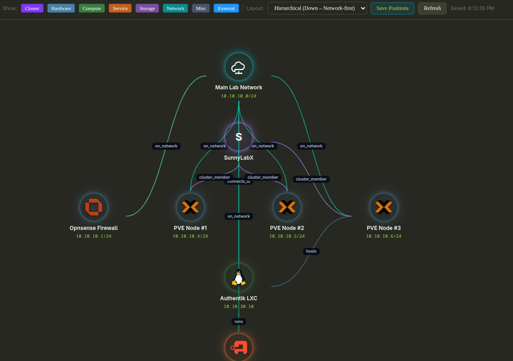
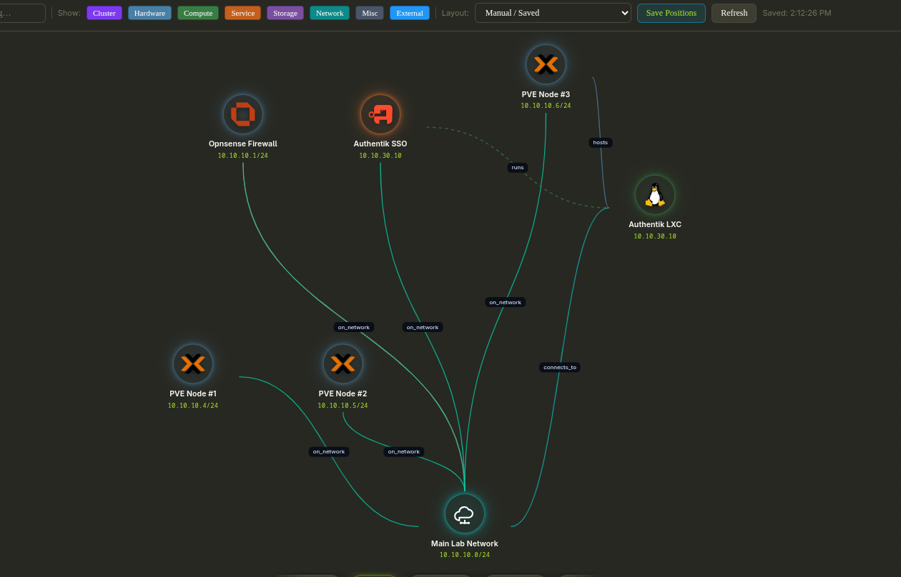

# Circuit Breaker


> **⚠️ SECURITY WARNING (BETA RELEASE v0.1.0):**  
> This application is currently in beta. It has not yet undergone a full security audit. Please run this application strictly on a secure, local network (e.g., your homelab or a private intranet). **Do not expose it directly to the public internet.** Ensure you take your own precautions for securing the app and safeguarding your data until the full production release.

The **Circuit Breaker** (formerly Service Layout Mapper) is a tool designed to help you easily document, track, and visualize your homelab or small business network topology.

## TOP FEATURES

- **Topology map with ready-to-use layouts:** Start fast with multiple pre-set map configurations (including cluster-centric and top-down styles) to visualize your infrastructure instantly.
- **Customizable layout control:** Fine-tune positions and structure to match your real environment, then save and reload your preferred layouts across sessions.
- **Rich theming options:** Choose from several built-in theme presets to personalize the UI and keep your dashboard readable in any setup.
- **Gravatar compatibility:** User profiles support Gravatar so account identity and activity context feel familiar right away.
- **Markdown docs with linkable content:** Built-in documentation tools let you write Markdown and generate linkable docs for services, systems, and operational notes.

## Quick Start

### Option A — One-line install (recommended, no clone required)

Requires Linux and Docker (the script will offer to install Docker if it isn't found):

```bash
curl -fsSL https://raw.githubusercontent.com/BlkLeg/circuitbreaker/main/install.sh | bash
```

Open: [http://localhost:8080](http://localhost:8080)

The installer checks your system, pulls the pre-built image from GHCR, starts the container, and prints every LAN address it is reachable on.

**Customization** — set env vars before piping to override defaults:

| Variable | Default | Description |
|---|---|---|
| `CB_PORT` | `8080` | Host port to expose |
| `CB_VOLUME` | `circuit-breaker-data` | Docker volume name or host path for data |
| `CB_IMAGE` | `ghcr.io/blkleg/circuitbreaker:latest` | Docker image to pull |
| `CB_CONTAINER` | `circuit-breaker` | Container name |

```bash
# Example: run on port 9090
CB_PORT=9090 curl -fsSL https://raw.githubusercontent.com/BlkLeg/circuitbreaker/main/install.sh | bash
```

**To uninstall:**

```bash
curl -fsSL https://raw.githubusercontent.com/BlkLeg/circuitbreaker/main/uninstall.sh | bash
```

---

### Option B — Docker Compose, no clone required

```bash
curl -fsSL https://raw.githubusercontent.com/BlkLeg/circuitbreaker/main/docker/docker-compose.prebuilt.yml \
  -o docker-compose.yml && docker compose up -d
```

Open: [http://localhost:8080](http://localhost:8080)

To update to the latest release: `docker compose pull && docker compose up -d`

---

### Option C — Build from source (single image)

```bash
# 1) Clone and build
git clone https://github.com/BlkLeg/circuitbreaker.git && cd circuitbreaker
docker build -t circuit-breaker:beta .

# 2a) Run with localhost-only binding (recommended for homelab / beta):
docker run --rm -p 127.0.0.1:8080:8080 -v circuit-breaker-data:/data circuit-breaker:beta

# 2b) Run bound to all interfaces (only if behind a firewall):
docker run --rm -p 8080:8080 -v circuit-breaker-data:/data circuit-breaker:beta
```

> **Note:** Option 2a binds the port exclusively to `127.0.0.1` so only the local machine can reach it. Option 2b binds to `0.0.0.0`, exposing the port on every interface including public-facing ones.

---

### Option D — Build from source (Docker Compose)

```bash
git clone https://github.com/BlkLeg/circuitbreaker.git && cd circuitbreaker
docker compose -f docker/docker-compose.yml up -d --build
```

> **Note:** The default Compose file exposes port 8080 on all interfaces. For local-only access, change `"8080:8080"` to `"127.0.0.1:8080:8080"` in `docker/docker-compose.yml` before starting.

---

### First-run setup / reset data

- On a fresh database the app opens the setup wizard to create the initial admin account.
- To reset to a fresh state:

```bash
# Remove the data volume (Options A, B, C)
docker volume rm -f circuit-breaker-data

# Compose stack + volume reset (Option D)
docker compose -f docker/docker-compose.yml down -v
```

## Screenshots

### Login Screen


### Cluster-Centric Topology View



### Custom Layout Example



### Hardware Inventory Page


### Top-Down Topology Layout


## Documentation

For more information on using the tool and our upcoming plans, please refer to:

- [Architecture & Overview](docs/OVERVIEW.md)
- [Project Roadmap](docs/ROADMAP.md)
- [Beta Pre-Flight Checklist](PRE_PKG.md)

Build docs locally with Zensical:

```bash
source .venv/bin/activate
make docs-build
make docs
```

## Inspiration

Netbox was my first attempt at IPAM. I only have two quarrels with it as a first time user back then:

1. It was too complex to navigate quickly and consistently.
2. There was no visual aspect that represents my lab. In their defense, it took me quite some time to come to that realization for myself.

At the time, I also had a lesser understanding of various aspects of IT and server documentation in generation. There's a very good chance I could feel differently now. To each their own.

### Disclaimer

This app was vibe coded from the ground up with a twist. I spent a week in the planning phase, simply listing the features and workflow I wanted to see in Notion. Then, each phase of the program was designed and tested in phases. At no point was any large element of this app built in "one shot". To keep the code honest, I use a combination of Dependabot, SonarQube, Snyk, and sentry to monitor for CVEs and bugs. Before the deployment of the BETA, all crictical and high risk vulnerabilities were patched.

As we move closer to v1, the code itself will become increasingly optimized for stability and maintainability. This will include things like having code that has low cognitive complexity, is self-explanatory with minimal help from comments,

### Promises

1. I will never charge for this app. As such, no paid contributors will be working on this app. Donations are always welcome, but don't feel obligated.
2. O
