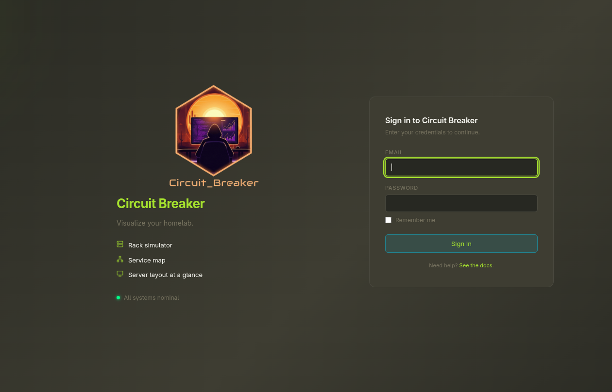
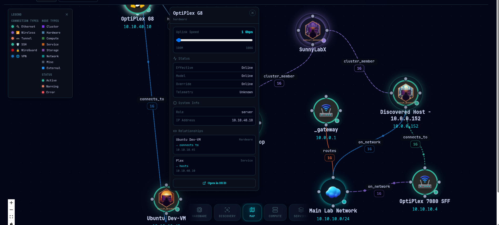
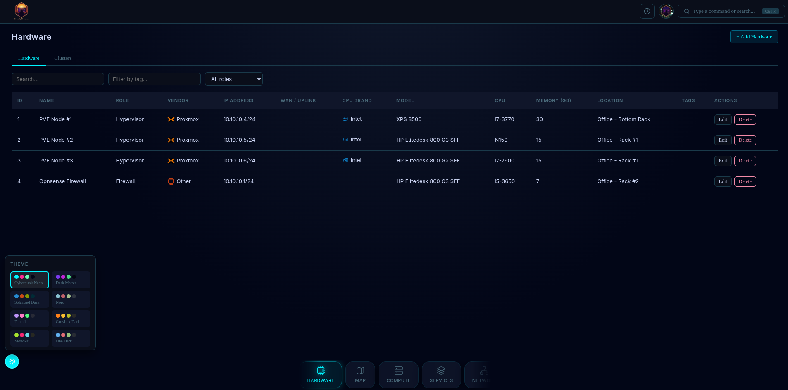
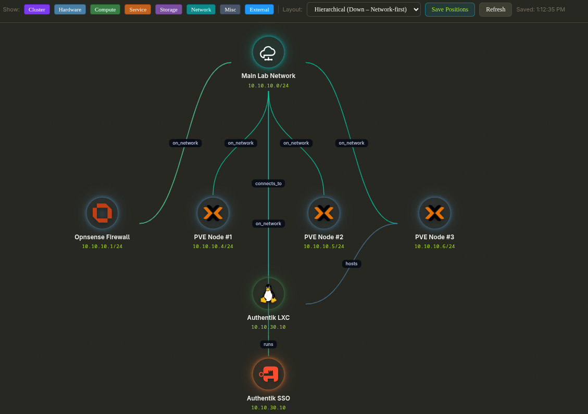

# Circuit Breaker


**Circuit Breaker** is a self-hosted homelab visualization platform that lets you document,
map, and understand your infrastructure — hardware, services, networks, and everything
in between — through an interactive topology map and rack simulator.

> **⚠️ Beta Security Notice**
> Circuit Breaker has not yet undergone a full security audit. Run it on a trusted local
> network or private intranet only. **Do not expose it directly to the public internet**
> until a production release is available. Take appropriate precautions to secure the
> application and protect your data.

📖 **[User Guide](https://blkleg.github.io/CircuitBreaker)** — get up to speed quickly

---

## Features

- **Interactive topology map** — visualize your infrastructure with multiple pre-built
  layouts including cluster-centric and top-down styles. Rearrange nodes freely and save
  your preferred layout across sessions.
- **Rack simulator** — model your physical rack in a drag-and-drop interface with
  U-height-aware placement and hardware binding.
- **Hardware & service inventory** — track physical devices, VMs, containers, networks,
  and services with a clean, searchable interface.
- **Vendor device catalog** — typeahead search across Dell, HPE, Ubiquiti, APC, Synology,
  MikroTik, Raspberry Pi, and more — with auto-filled specs and rack heights.
- **Telemetry integration** — connect iDRAC, iLO, APC UPS, CyberPower, and generic SNMP
  devices to surface live health badges directly on the topology map.
- **Markdown documentation** — write linked, linkable runbooks and notes attached to any
  entity in your lab.
- **Rich theming** — 8+ built-in theme presets with live preview to keep the dashboard
  readable in any environment.
- **Gravatar support** — account profiles pull from Gravatar for a familiar feel.

---
## Live Demo

## Screenshots

### Login Screen



### Speed-centric connections (w/ live animations)
[topology-1.webm](https://github.com/user-attachments/assets/7262ec4e-7527-47a9-9073-38d7c92fda1a)


The lowest node speed dictates the overall speed of the animation to mimic real-world effects.

1. Various connection types with their own animations/colors.
2. Bandwidth slider dictates animation speed.
3. State management

### Custom Layout Example


### Hardware Inventory Page



### Top-Down Topology Layout



### Mobile Friendly Layout


---

## Quick Start

### Option A — One-line install *(recommended)*

Requires Linux and Docker. The script will offer to install Docker if it isn't found.

```bash
curl -fsSL https://raw.githubusercontent.com/BlkLeg/circuitbreaker/main/install.sh | bash
```

Then open: [http://localhost:8080](http://localhost:8080)

The installer pulls the pre-built image from GHCR, starts the container, and prints every
LAN address it is reachable on.

**Environment variable overrides:**

| Variable | Default | Description |
| --- | --- | --- |
| `CB_PORT` | `8080` | Host port to expose |
| `CB_VOLUME` | `circuit-breaker-data` | Docker volume name or host path |
| `CB_IMAGE` | `ghcr.io/blkleg/circuitbreaker:latest` | Docker image to pull |
| `CB_CONTAINER` | `circuit-breaker` | Container name |

```bash
# Example: run on port 9090
CB_PORT=9090 curl -fsSL https://raw.githubusercontent.com/BlkLeg/circuitbreaker/main/install.sh | bash
```

**To uninstall:**

```bash
curl -fsSL https://raw.githubusercontent.com/BlkLeg/circuitbreaker/main/uninstall.sh | bash
```

---

### Option B — Docker Compose *(no clone required)*

**Download and run in one command:**

```bash
curl -fsSL https://raw.githubusercontent.com/BlkLeg/circuitbreaker/main/docker/docker-compose.prebuilt.yml \
  -o docker-compose.yml && docker compose up -d
```

**Or paste this into your own `docker-compose.yml`:**

```yaml
services:
  circuit-breaker:
    image: ghcr.io/blkleg/circuitbreaker:latest
    container_name: circuit-breaker
    read_only: true
    tmpfs:
      - /tmp
    security_opt:
      - no-new-privileges:true
    ports:
      # Bind to 127.0.0.1 for local-only access (recommended during beta).
      # Change to "8080:8080" to expose on all interfaces (only if behind a firewall).
      - "127.0.0.1:8080:8080"
    volumes:
      - circuit-breaker-data:/data
    environment:
      - DATABASE_URL=sqlite:////data/app.db
      - UPLOADS_DIR=/data/uploads
    restart: unless-stopped
    healthcheck:
      test: ["CMD", "wget", "--no-verbose", "--tries=1", "--spider", "http://localhost:8080/api/v1/health"]
      interval: 30s
      timeout: 10s
      retries: 3
      start_period: 15s

volumes:
  circuit-breaker-data:
    # Named volume — data persists across restarts and updates.
    # To inspect: docker volume inspect circuit-breaker-data
```

Open: [http://localhost:8080](http://localhost:8080)

To update: `docker compose pull && docker compose up -d`

---

### Option C — Build from source *(single image)*

```bash
git clone https://github.com/BlkLeg/circuitbreaker.git && cd circuitbreaker
docker build -t circuit-breaker:beta .

# Local-only access (recommended):
docker run --rm -p 127.0.0.1:8080:8080 -v circuit-breaker-data:/data circuit-breaker:beta

# Expose on all interfaces (only if behind a firewall):
docker run --rm -p 8080:8080 -v circuit-breaker-data:/data circuit-breaker:beta
```

---

### Option D — Build from source *(Docker Compose)*

```bash
git clone https://github.com/BlkLeg/circuitbreaker.git && cd circuitbreaker
docker compose -f docker/docker-compose.yml up -d --build
```

> For local-only access, change `"8080:8080"` to `"127.0.0.1:8080:8080"` in
> `docker/docker-compose.yml` before starting.

---

### First Run & Data Reset

On a fresh database, Circuit Breaker opens a setup wizard to create the initial admin
account and configure your preferences.

**To reset to a clean state:**

```bash
# Options A, B, or C
docker volume rm -f circuit-breaker-data

# Option D (Compose stack)
docker compose -f docker/docker-compose.yml down -v
```

---

## Documentation

- [Architecture & Overview](docs/OVERVIEW.md)
- [Project Roadmap](docs/ROADMAP.md)
- [Beta Pre-Flight Checklist](PRE_PKG.md)

**Build docs locally with Zensical:**

```bash
source .venv/bin/activate
make docs-build
make docs
```

---

## Background

Circuit Breaker grew out of frustration with existing IPAM and documentation tools.
NetBox was the first stop — powerful, but complex to navigate quickly and entirely without
a visual representation of the lab. That gap was the spark.

The goal was always something simpler: drop in a device, draw some lines, understand
your lab at a glance. Everything else is built on top of that principle.

---

## How It Was Built

Circuit Breaker was designed deliberately rather than thrown together. Development began
with a full week of planning in Notion — mapping out features, workflows, and data models
before a single line of code was written. From there, each feature was built and tested
in isolated phases; nothing significant was shipped in a single unreviewed pass.

Code quality is actively monitored using **Dependabot**, **SonarQube**, and **Snyk**.
All critical and high-severity vulnerabilities were resolved before the beta
release. As the project approaches v1, the focus will increasingly shift to stability,
maintainability, and low cognitive complexity throughout the codebase.

> The `dev` branch is unstable and not recommended for general use.

---

## A Few Commitments

1. **Circuit Breaker will always be free.** No paid contributors, no paywalled features.
   Donations are welcome but never expected.
2. **During the beta, please limit bug reports to functional and security issues.** The
   codebase is still being optimized — keeping reports focused avoids duplicate effort
   and helps things move faster.

---

## Support the Project

If Circuit Breaker saves you time or headaches, consider buying a coffee.

**Cash App:** `$blkleg`

A Discord community is coming soon. Thanks for checking out the project — I hope it
makes your homelab a little easier to understand. 🖥️
