<div align="center">

<a href="https://circuitbreaker.blkleg.app">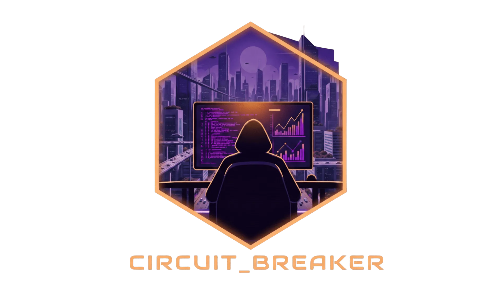</a>

# Circuit Breaker

**Your whole homelab on one live map.**<br>
Hardware, VMs, containers, services and networks, with live health, auto-discovery and remote agents.<br>
Self-hosted, runs on your own box, and never locks your data in.

[](https://github.com/BlkLeg/CircuitBreaker/releases/latest)
[](LICENSE)
[](https://discord.gg/SBdBRfmD)

**[Website](https://circuitbreaker.blkleg.app)** · **[Live demo](https://circuitbreaker.blkleg.app/demo)** · **[User guide](https://blkleg.github.io/CircuitBreaker/)** · **[Discord](https://discord.gg/SBdBRfmD)** · **[X / Twitter](https://x.com/TryHostingCB)**

</div>

---

## Install in one line

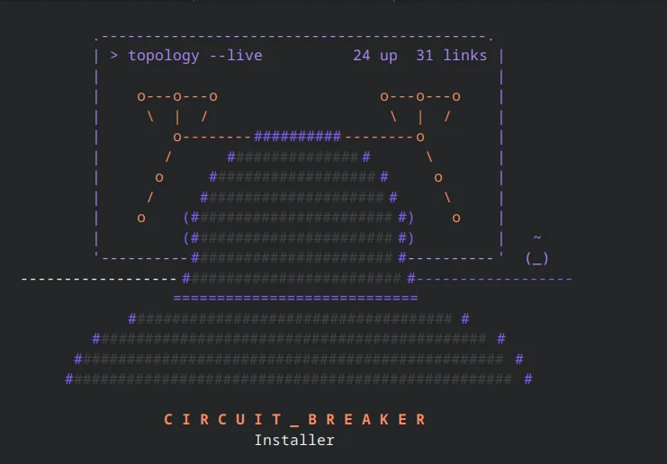

```bash
curl -fsSL https://raw.githubusercontent.com/BlkLeg/CircuitBreaker/main/install.sh | sudo bash
```

Installs natively as systemd services, with no Docker required, on **Ubuntu, Debian, Fedora, RHEL, Rocky Linux, AlmaLinux and Arch**. When it finishes it prints the address of the setup wizard, `https://<host>/`, where you create the first admin account. The certificate is self-signed by default, so expect a browser warning the first time.

On a Proxmox host, or prefer Docker? See [other ways to install](#other-ways-to-install).

> **See it before you install it.** [circuitbreaker.blkleg.app](https://circuitbreaker.blkleg.app) walks through what Circuit Breaker does, and the [live demo](https://circuitbreaker.blkleg.app/demo) runs the topology map in your browser. No install, no account.

> **Security notice**
> 0.4.6. Not fully audited; several 1.0 security acceptance rows are still unevidenced. Run it on a
> trusted LAN or behind a VPN. Exposing it directly to the internet is outside the 1.0.0 support
> boundary, described in [docs/release/1.0.0-support-contract.md](docs/release/1.0.0-support-contract.md).

---

## Screenshots

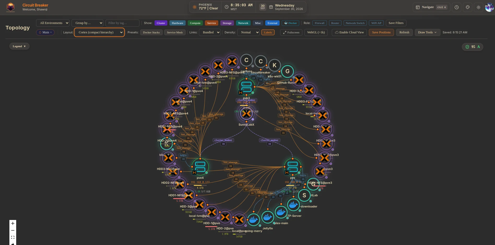

<table>
  <tr>
    <td width="50%">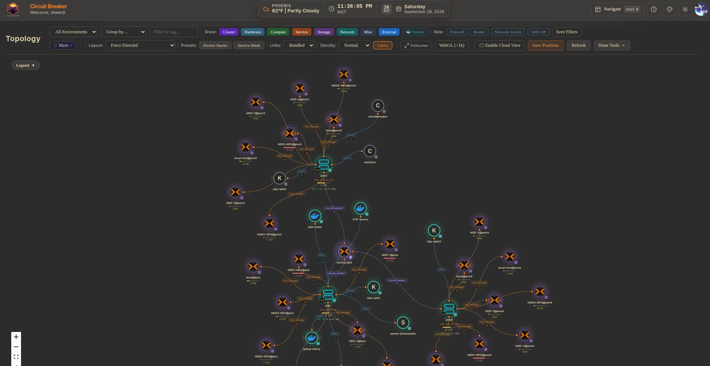<br><sub><b>Topology map.</b> Hardware, VMs, containers and services with live health and link speeds.</sub></td>
    <td width="50%">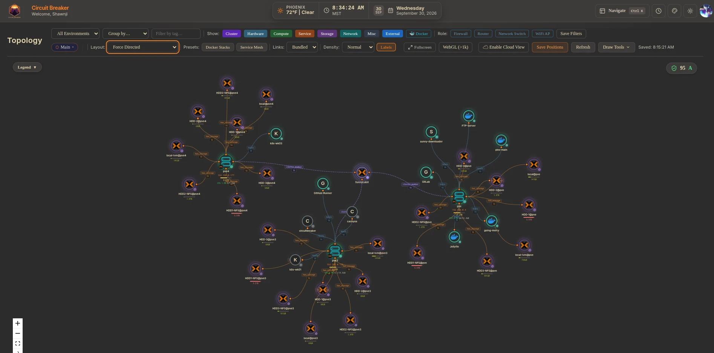<br><sub><b>Layouts.</b> Hierarchical, concentric and cortex rings, force-directed and more. Drag to arrange; positions save.</sub></td>
  </tr>
  <tr>
    <td width="50%">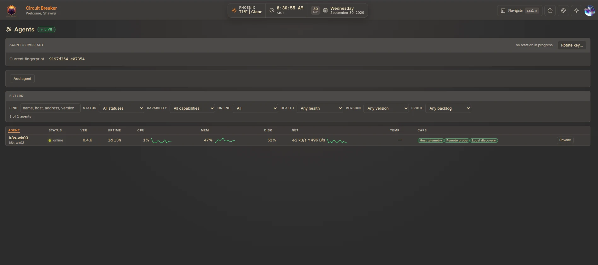<br><sub><b>Agent fleet.</b> Every remote agent's state, version, capabilities and live CPU, memory and network.</sub></td>
    <td width="50%">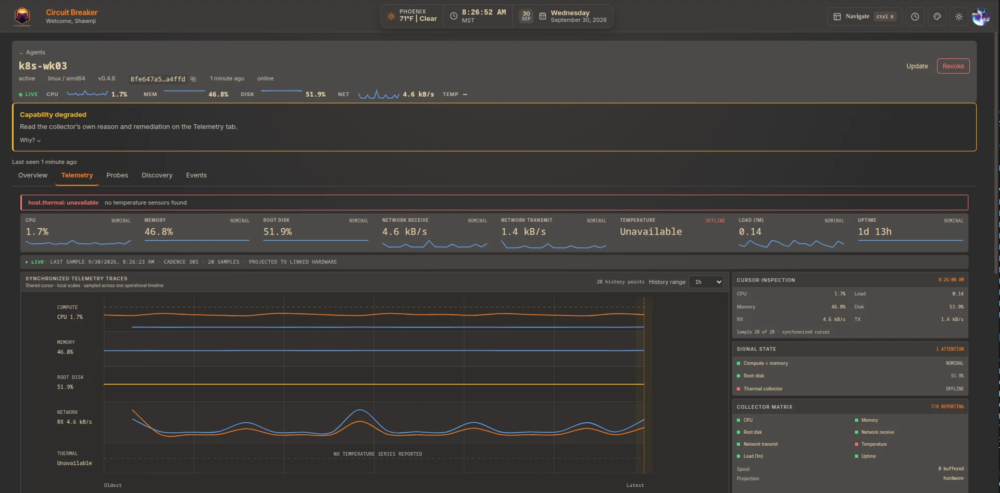<br><sub><b>Host telemetry.</b> History from inside networks the server cannot reach.</sub></td>
  </tr>
  <tr>
    <td width="50%">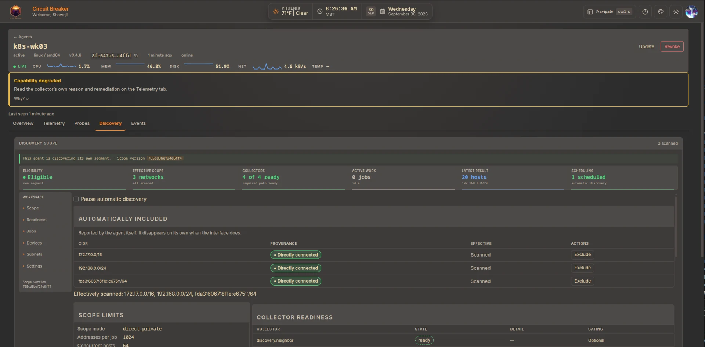<br><sub><b>Discovery.</b> Scan from where the devices are, within the scope you allow, and review before anything is added.</sub></td>
    <td width="50%">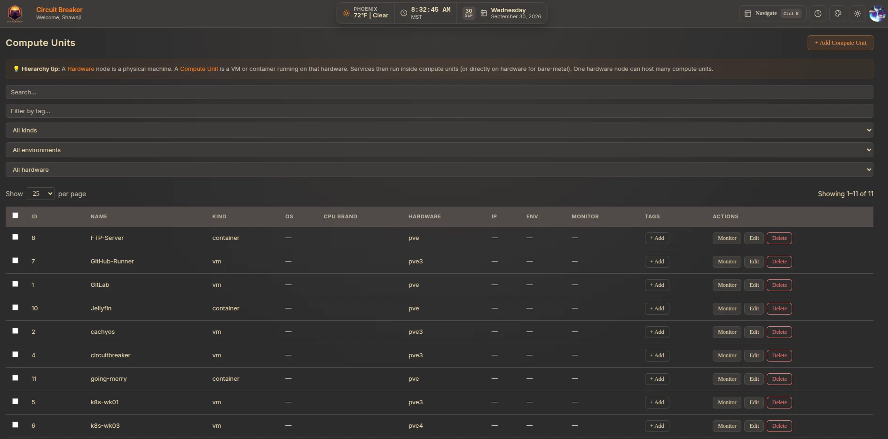<br><sub><b>Inventory.</b> VMs and containers alongside the hardware they run on.</sub></td>
  </tr>
  <tr>
    <td width="50%">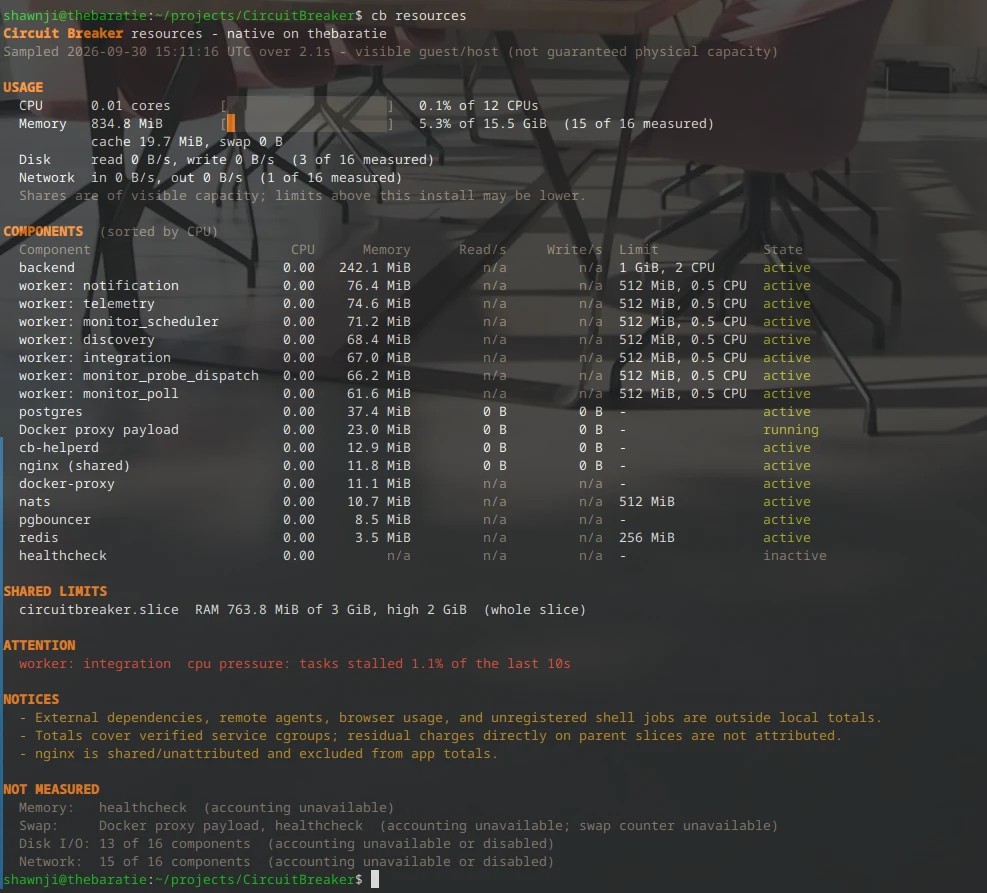<br><sub><b><code>cb resources</code>.</b> What the installation uses, per service, with its limits.</sub></td>
    <td width="50%" align="center">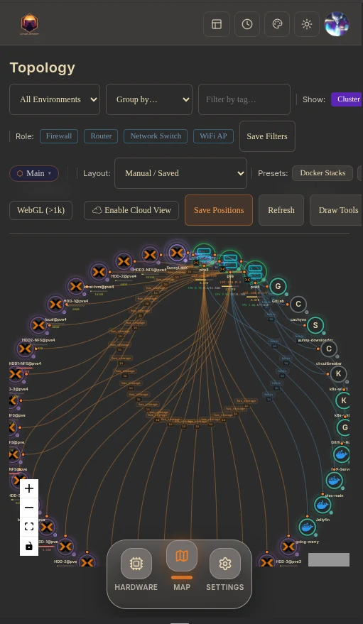<br><sub><b>On your phone.</b> The map and controls adapt to a small screen.</sub></td>
  </tr>
</table>

More in the [screenshot gallery](docs/screenshots.md).

---

## What it does

- **Topology map.** Draw your lab by hand or let discovery fill it in. Hierarchical, concentric, cortex, radial and force-directed layouts, live link animations, boundaries and labels, and positions that stay where you put them.
- **Auto-discovery.** Scan your LAN with nmap, SNMP and ARP, and pull in Proxmox nodes, VMs and containers, TrueNAS pools and UniFi devices. Everything lands in a review queue before it touches your map.
- **Live health.** iDRAC, iLO, APC UPS and SNMP telemetry update over WebSockets, with green, amber and red health rings on the map.
- **Remote agents.** Install `cb-agent` on Linux machines at another site or on a separate VLAN for host telemetry, monitor probes and discovery from inside networks the server cannot reach. Agents connect outbound only, over Noise-encrypted links, so there is no inbound firewall rule to open. Every agent is approved by fingerprint before it is trusted.
- **Proxmox integration.** Connect a cluster with an API token and see its nodes, VMs, containers and storage with live metrics.
- **Rack diagrams.** Drag devices into U slots, overlay cabling, and inspect each rack.
- **Vendor catalog.** 76 devices from 20 vendors, including Dell, HPE, Supermicro, Ubiquiti, MikroTik, Synology and APC, to speed up entry. Anything you type yourself always saves.
- **Backups you can restore.** `cb backup` takes a full-state snapshot, including the database, uploads, config and vault key, and can encrypt a copy to store off the host. `cb restore` puts it back.
- **Audit log.** Every change is recorded with actor, address and diff in a tamper-evident SHA-256 hash chain.

---

## Security

- **Sign-in:** bcrypt passwords, TOTP multi-factor, GitHub and Google sign-in, and generic OIDC (Authentik, Keycloak and others), with HttpOnly session cookies.
- **Roles:** viewer, editor, admin and demo, with granular scopes and a fully audited admin masquerade.
- **Secrets vault:** every stored credential is Fernet-encrypted at rest. The key lives in a root-owned `0640` environment file, never in the database, and rotates automatically.
- **Transport:** HTTPS through nginx, with Let's Encrypt for public domains and a local certificate authority for your LAN.
- **Hardening:** CSP, HSTS, frame protection, rate limiting and an SSRF guard.

Details are in [Security and deployment](docs/deployment-security.md).

---

## Other ways to install

### Proxmox LXC

Run this on your Proxmox VE host:

```bash
bash -c "$(curl -fsSL https://raw.githubusercontent.com/BlkLeg/CircuitBreaker/main/cb-proxmox-deploy.sh)"
```

It creates a Debian 12 container, installs Circuit Breaker inside it and connects it to your Proxmox API. A guided setup walks you through it in about three minutes.

### Docker Compose

```bash
curl -fsSL https://raw.githubusercontent.com/BlkLeg/CircuitBreaker/main/install.sh | bash -s -- --docker
```

Installs Docker only if it is missing, downloads the official Compose templates into `~/.circuitbreaker`, generates an `.env` with fresh secrets, and starts the stack. See [Docker Compose](docs/installation/docker-compose.md) for environment variables, persistence, ARP scanning and the Docker socket.

### Upgrading and uninstalling

| Install | Upgrade | Uninstall |
|---|---|---|
| Native or Proxmox LXC | `curl -fsSL https://raw.githubusercontent.com/BlkLeg/CircuitBreaker/main/install.sh \| sudo bash -s -- --upgrade` | `cb uninstall` |
| Docker Compose | `cd ~/.circuitbreaker && docker compose pull && docker compose up -d` | `docker compose down` in `~/.circuitbreaker` |

A native upgrade takes a database backup before it changes anything. For a Proxmox LXC, run it inside the container, for example with `pct exec <CTID> -- bash`. More in [Upgrading](docs/installation/upgrading.md).

---

## The `cb` command

Native and Proxmox installs come with `cb`, the command-line companion. Run `cb help` for everything; these are the ones you will use most:

| Command | What it does |
|---|---|
| `cb status` | Show the state of every Circuit Breaker service |
| `cb doctor` | Run health checks and explain what is wrong |
| `cb resources` | Show CPU, memory, disk and network use per service, with limits. Add `--watch` for a live view |
| `cb logs -f` | Follow the logs live |
| `cb backup` | Take a full-state snapshot. Add `--encrypt-to age1…` for a copy safe to store off this host |
| `cb restore <archive>` | Restore a snapshot |
| `cb agent list` | List agents; `cb agent approve` and `cb agent revoke` manage them |
| `cb user list` | Manage local accounts |
| `cb diag bundle` | Write one redacted archive to attach to a bug report |
| `cb info` | Show the install mode, paths and health URL |
| `cb version` | Show the installed version |
| `cb uninstall` | Remove Circuit Breaker from this system |

---

## Documentation

- [Overview](docs/overview.md) and [Getting started](docs/getting-started.md)
- [Installation](docs/installation/index.md) and [Upgrading](docs/installation/upgrading.md)
- [cb-agent](docs/agent.md)
- [Backup and restore](docs/backup-restore.md)
- [Security and deployment](docs/deployment-security.md)
- [1.0 support contract](docs/release/1.0.0-support-contract.md)
- [Roadmap](docs/roadmap.md)

The full user guide is at **[blkleg.github.io/CircuitBreaker](https://blkleg.github.io/CircuitBreaker/)**.

---

## Community

Questions, ideas and homelab showcases are welcome on **[Discord](https://discord.gg/SBdBRfmD)**. Follow **[@TryHostingCB](https://x.com/TryHostingCB)** for release news.

Circuit Breaker is open source under the [MIT License](LICENSE).
