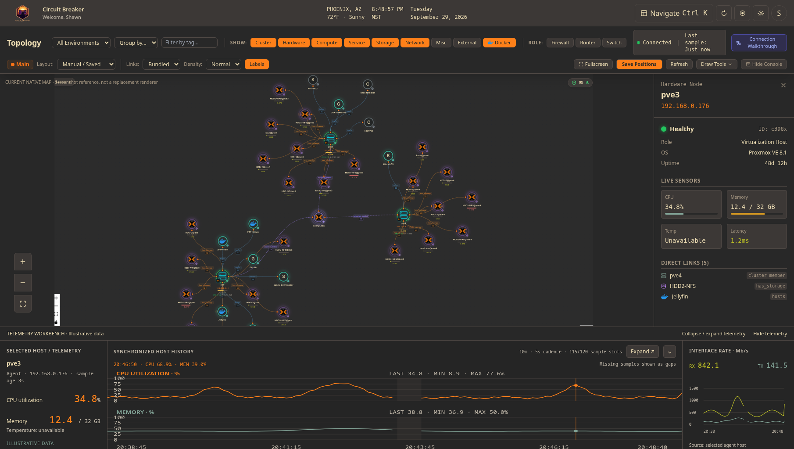
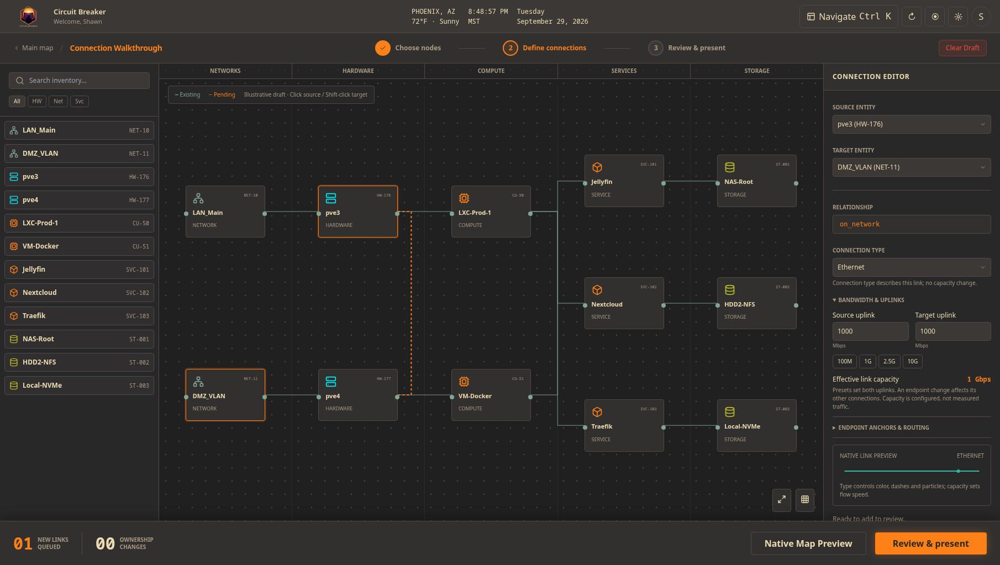
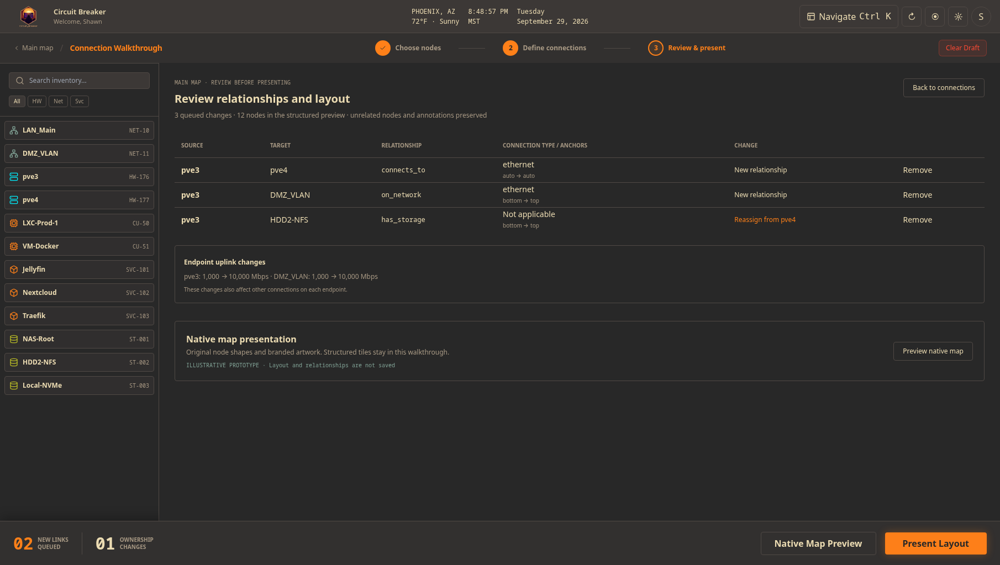

# Map console and connection walkthrough — approved design

**Date:** 2026-09-29. **Target:** v0.5.0.  
**Status:** visual design approved; application implementation pending. This record documents the design and its implementation contract, not shipped behavior.  
**Approval:** map console version 5 — “This is much better. I approve of this.” Connection walkthrough version 7 — “This is good. Write up the design.”  
**Canvas:** [Circuit Breaker map upgrade](https://superdesign.dev/teams/4281dc54-7c08-491e-9c06-483e758fa325/projects/a44eac63-f5b5-4185-b1c9-18d768ecbc40).  
**Approved references:** [map console, version 5](https://p.superdesign.dev/draft/d065afe9-56b1-4c40-b88e-ecb6dd755281) and [connection walkthrough, version 7](https://p.superdesign.dev/draft/c8e6462a-4db9-44f4-86eb-042aa156bd05). Remote previews follow the latest version; the versions named here are the approval boundary. Frozen HTML and screenshots are in [the reference bundle](assets/map-console-and-walkthrough/README.md).

## Outcome and scope

Give the map the precision and visual quality of an enterprise NOC/SOC while retaining the topology identity users know. The map remains the main experience. Its device silhouettes, node shapes, branded SVGs, vendor artwork, badges, handles and status rings stay intact.

Approval covers two complementary surfaces: a fully hideable operations console around the native map, and an optional structured connection walkthrough. Rectangular equipment tiles belong to the walkthrough only. **Present Layout** returns the reviewed result to the native map renderer.

Use the three September 2026 screenshots on the canvas as the current visual baseline. The historical v0.2.2 screenshot and earlier drafts that replaced native nodes are superseded. The existing header and navigation retain their own design ownership; sample weather, names, timestamps, topology and telemetry are illustrative content.

This is primarily a visual upgrade. Live updates, hover metrics, selected-node details, relationships, security overlays, search, grouping, layouts, fullscreen and recent entity changes already exist in related forms. The [capability audit](../../plans/v0.5.0-map-feature-audit.md) separates reuse from new work.

## Visual system

Use the user's active semantic theme tokens. Gruvbox is the approved reference theme, with warm neutral surfaces, thin dividers, orange command accents and the existing role/status colors. Preserve the real Circuit Breaker logo. Use the existing system sans font and system monospace for IDs, addresses and telemetry; introduce no external font dependency.

The enterprise treatment comes from alignment, readable density, clear hierarchy and precise data presentation. Use restrained shadows, selection rings and meaningful update feedback. Avoid decorative scanning effects, heavy bloom, bounce and continuous attention-seeking motion. Honor reduced motion.

## Native map console

The desktop composition has a compact command area, a dominant native map, a selected-entity inspector on the right, and a telemetry workbench along the bottom. Group existing actions so the topology and operational information carry more visual weight than equally emphasized buttons.

The inspector presents selected identity, address, role, health, readings, source/freshness and relationships. It follows the selected entity through live updates and preserves its actual artwork. Do not display inconsistent host identity or readings between the inspector and workbench.

The lower workbench has three adjoining panes:

| Pane | Content |
| --- | --- |
| Left | Selected host, source, sample age, current CPU/memory and availability states. |
| Middle | Synchronized CPU and memory histories, cursor readings, last/min/max, time ticks and missing-data gaps. |
| Right | RX/TX histories and values with explicit rate units and source. |

**The middle pane's chart grids and traces span the full pane, meeting both neighboring pane dividers.** Keep headers and labels readable with internal text padding; do not reintroduce a centered, inset plotting island. CPU and memory lanes share the same time domain and cursor. Maintain fixed percent scales and readable ticks when the pane resizes.

The prototype's desktop pane widths are approximately 245px / flexible middle / 255px. These are composition references, not fixed requirements for every viewport. Preserve usable chart space when adapting to narrower screens; use drawers or stacked analysis rather than shrinking labels into illegibility.

### Visibility and fullscreen

Provide expanded, collapsed and hidden console states. A collapsed workbench retains a compact header; a hidden pane reserves zero space. The inspector and telemetry workbench can be hidden independently and restored from visible controls.

**Hide Console** removes the operational chrome and panes together, reclaiming the canvas. A small **Restore Console** control remains available. Fullscreen supports this clean-map presentation and an obvious restore/exit action.

Toggling visibility preserves selection, viewport, node positions, filters, document state and live updates. It does not trigger a relayout/refit, mark the map dirty, reset the selected host or reload the page. Restore the user's previous pane configuration.

### Telemetry contract

Use real history available for the selected source. Agent telemetry and monitor latency already have histories; generic entity telemetry currently supplies at most 20 recent metric rows total, not a complete series for every metric.

- CPU and memory percent use fixed 0–100 scales; CPU utilization and load retain separate units. RX/TX use an explicit shared rate scale.
- Position samples by actual timestamps. Display source, range, cadence/count, freshness, units, current and inspected values, and last/min/max where available.
- Render missing spans as gaps. Do not smooth invented samples, splice different sources, fabricate temperature, or infer incidents from unrelated traces.
- Show configured thresholds only when real settings exist. Short/empty histories show an honest insufficient-history state.
- Configured connection capacity is not measured utilization. Draft traces and readings remain visibly marked illustrative.

The existing agent telemetry workbench is the quality floor for production charts. The prototype validates composition, not live telemetry fidelity or performance.

## Connection walkthrough

Open **Connection Walkthrough** from the map as a dedicated working view. Carry the active map identity throughout the flow. Use a searchable inventory rail, a dominant structured relationship diagram, a contextual connection editor, and a persistent review bar.

The diagram uses compact equipment tiles with name, role, stable entity identity and recognizable icon/artwork. The approved example organizes twelve entities into Network, Hardware, Compute, Services and Storage columns. The count and sample entities are illustrative; production uses the selected map's actual inventory.

Connectors attach to visible endpoint ports. Existing relationships use quiet solid paths; pending relationships use dashed amber paths with a legend and textual state. Selected endpoints receive a clear outline. Do not use color alone to communicate validity.

### Step 1 — Choose nodes

Search the active inventory by supported name/address/identity fields and filter by entity type. Choose endpoints from the inventory or diagram. Preserve the underlying IDs and metadata. The prototype demonstrates click for source and Shift-click for target; explicit selectors remain available so mouse gestures are optional.

Draft editing does not change the saved map. Navigation away from pending work asks whether to discard it. Clearing the draft affects staged work, not persisted relationships.

### Step 2 — Define connections

Derive the supported relationship from endpoint types and metadata. Relationship semantics are distinct from connection type. Validate canonical endpoint direction, duplicate relationships, missing hosting metadata, entity existence and editing permission. The `LINK_ITEMS` table is a candidate filter; `linkMutations.js` contains the actual mutation behavior.

| Control | Approved behavior |
| --- | --- |
| Source and target | Select real entities; emphasize them in the structured graph. Offer supported pairs and explain invalid selections. |
| Relationship | Show the derived relationship; do not allow arbitrary relation names. |
| Connection type | Offer all twelve current canonical types where the mutation supports them. Disable for ownership assignments such as `hosts` or `has_storage`. |
| Uplink speeds | Source/target Mbps inputs, readable Mbps/Gbps result, and 100M, 1G, 2.5G, 10G presets. Presets set both displayed endpoint speeds. |
| Effective capacity | Derive from the slower endpoint and current connection-type cap. Clearly identify configured capacity rather than measured traffic. |
| Endpoint anchors | Source/target Auto, Top, Right, Bottom, Left; carry through existing map edge overrides. |
| Bend reset | Clear the custom bend point and restore automatic routing; preserve unrelated overrides. |
| Native link preview | Show the current type's color, dash pattern and particles; speed changes update the flow preview. |
| Queue | Add, edit or remove staged changes. Removal does not unlink an existing relationship. |

Canonical types: `ethernet`, `wireless`, `tunnel`, `wg`, `vpn`, `ssh`, `fiber`, `bgp`, `vlan`, `management`, `backup`, `heartbeat`.

Reuse current bandwidth behavior: the slower endpoint limits capacity, wireless is capped at 300 Mbps, and tunnel/VPN at 100 Mbps. These are the app's current calculation rules, not universal physical limits. Changing an endpoint's uplink affects its other connections, so disclose the scope beside the controls and list endpoint updates separately in review. Reuse hardware speed persistence and existing non-hardware uplink preferences; do not imply a new per-link bandwidth write API already exists.

Color, dashes, line widths and particle settings currently follow `CONNECTION_STYLES` and bandwidth. Preserve that profile in the preview. Independent color, custom label, line-width and animation-speed editors are not part of the approved existing-control reuse. Capacity and animation speed must not be conflated with observed traffic direction or throughput.

Ownership changes require explicit acknowledgement. For example, assigning storage to a different hardware host changes its parent; it is not an additional cable. Show the prior and proposed owner, gate queueing until acknowledged, and revalidate that ownership before publication.

### Step 3 — Review and present

Review lists source, target, relationship, connection type, anchor sides and the kind of change. Show new relationships separately from ownership changes, and list endpoint uplink updates with before/after values. Include affected node positions and active map identity in the production review. Allow returning to the editor without losing staged work.

Preview the result with the normal map renderer and original node shapes/artwork. **Present Layout** applies the reviewed operations and positions, then returns to the familiar map. Preserve unrelated entities, annotations, boundaries, labels, branded icons, shapes and user edge overrides. Never replace the native map's nodes with walkthrough tiles.

### Publication and partial failure

Revalidate map identity, current entities, permissions, duplicates, ownership and document changes before applying. Use the existing relationship APIs, which persist operations individually. Do not promise an atomic batch or automatic rollback.

Track successful, failed and outstanding operations. If a subset fails, keep the review open and provide an explicit retryable result. Refresh authoritative state and retry only outstanding work without duplicating successes. Publish layout positions after reviewed relationship and endpoint-speed operations succeed. If layout saving subsequently fails, explain that data changes were applied but layout saving failed, and offer a layout-only retry.

The exact backend execution sequence and concurrency handling require implementation. Destructive relationship removal and undo of already persisted changes are outside this design's default queue-removal behavior.

## Implementation contract

All new frontend components, state models, helpers and tests use **TypeScript/TSX**. Integrate incrementally with the existing JSX map; a wholesale migration is not required.

Reuse the canonical document, native renderer, node IDs, source histories, existing streams/polling, API mappings and layout codec. Keep live refreshes separate from the staged walkthrough draft. Revalidate staged changes against authoritative state rather than allowing updates to silently overwrite the review.

| Existing foundation | Purpose |
| --- | --- |
| `features/map/components/CustomNode.jsx` | Protected native identity and node rendering. |
| `features/map/components/CustomEdge.jsx` and `config/mapTheme.js` | Native link styling, bandwidth labels and animation profile. |
| `features/map/components/EdgeInspector.jsx` | Existing connection types, anchors and bend reset. |
| `features/map/model/linkMutations.js` | Supported relationships, canonical directions and persistence. |
| `features/map/model/connectionTypes.js` | Canonical types, bandwidth formatting and particle timing. |
| `utils/bandwidthCalculator.js` and map uplink handlers | Existing endpoint speed/capacity calculation and persistence. |
| `features/map/model/layoutCodec.js` | Map positions, shapes, overrides and annotations. |
| `components/agents/AgentTelemetryTab.jsx` | Existing history-chart quality and interactions. |

New engineering work includes the console composition/visibility state, production telemetry adapters, staged relationship editor, structured placement preview, publication/retry orchestration and native-renderer handoff. Large-map renderer parity and update performance must be measured; the visual design makes no performance guarantee.

## Verification and remaining work

The desktop reference was inspected at 1810×1023. The walkthrough prototype passed browser checks for its twelve-node graph, speed presets/type caps, anchor settings, queue changes, duplicates, ownership gating, unsupported pairs, review, search and demo handoff. Prototype interaction helpers were authored in TypeScript.

The map reference in both prototypes is a screenshot, not a live graph. **Present Layout is demo-only and saves nothing.** The prototype does not establish production drag placement, persisted layout changes, backend retries, live telemetry, renderer parity, responsive behavior or full accessibility compliance. Its frozen artifacts preserve visual decisions; implement behavior through the app's actual components and data model.

Production acceptance requires:

- Original shapes/artwork remain intact through editing, presenting, map switching and live updates.
- Middle-pane charts meet adjacent dividers and retain readable scales, honest histories and a shared cursor.
- Hide/collapse/restore and fullscreen preserve state and reserve no space when hidden.
- Endpoint rules, reassignment acknowledgement, uplink scope, anchors and bend reset persist correctly.
- Review accurately reflects pending changes; successful operations are not duplicated after partial failure.
- Keyboard access, focus, dialogs, theme contrast, reduced motion and narrower layouts work across the flow.
- TypeScript checks, focused behavioral tests, map interaction checks and the production build pass for implemented work.

Related records: [map upgrade scope](../../plans/v0.5.0-map-upgrade.md), [walkthrough contract](../../plans/v0.5.0-connection-walkthrough.md), and [capability audit](../../plans/v0.5.0-map-feature-audit.md).
