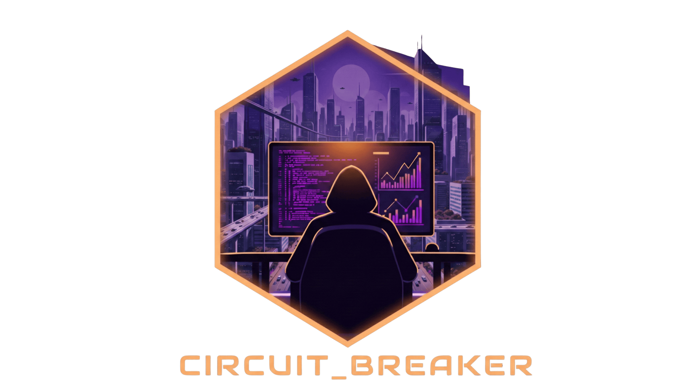

# Welcome to Circuit Breaker

**Circuit Breaker** is a self-hosted app for mapping your infrastructure in one place.

You can track your hardware, compute, services, storage, and networks, then see how everything connects on a live topology map. You can also attach notes and runbooks to the things you manage so your documentation stays with your inventory.

Use [Getting Started](getting-started.md) for first setup, then browse feature guides from the left navigation.

## Why Circuit Breaker?

- **See the full picture:** Understand where each service runs and what it depends on.
- **Keep docs where work happens:** Attach notes, links, and runbooks directly to your assets.
- **Plan changes with confidence:** Use dependencies and audit history to reduce surprises.

## Core Concepts

In Circuit Breaker, your lab is built upon these fundamental layers:

1. **Hardware**: Physical components like servers (nodes), switches, firewalls, NAS units, UPS devices, and more.
2. **Compute**: Virtualized environments that run on your Hardware, such as VMs and LXC containers.
3. **Services**: The actual applications you host (e.g., Plex, Home Assistant, databases), which run on your Compute units.
4. **Storage & Networks**: Shared resources that Services and Hardware depend on, such as storage pools, ZFS datasets, and VLANs.
5. **Topology Map**: A live visual map of how your components connect, including health rings when telemetry is enabled.
6. **Audit Log**: A searchable activity history showing what changed, who changed it, and when.

To see how to begin adding these components, proceed to [Getting Started](getting-started.md).

## Key Features Available Now

- **[Auto-Discovery (Beta)](discovery.md):** Scan selected network ranges, review results, then merge approved items into your inventory.
- **[IPAM](ipam.md):** Unified network management — prefixes, IP addresses, VLANs, and sites in one place.
- **[Certificates](certificates.md):** Track TLS/SSL certificate expiry across your homelab.
- **[External / Cloud Nodes](external-nodes.md):** Document cloud VMs, managed databases, and other external dependencies on the topology map.
- **[Status Pages](status-pages.md):** Create public-facing status boards backed by your Circuit Breaker monitors.
- **[Settings](settings.md):** Control language, timezone, appearance, map defaults, and system behavior.
- **[Authentication & Access](auth-access.md):** Local auth, OAuth/OIDC, MFA, invites, and recovery workflows.
- **[Webhooks & Notifications](integrations-webhooks-notifications.md):** Route events to external tools and manage delivery.
- **[Backup & Restore](backup-restore.md):** Export your inventory snapshot and restore when needed.
- **[Deployment & Security](deployment-security.md):** Choose a quick lab setup or a hardened setup.

## Integrations

- **[Hardware Telemetry](hardware.md#telemetry)** — Connect to Dell iDRAC, HPE iLO, APC/CyberPower UPS, or any SNMP device to show live health data directly on the topology map.
- **[Prometheus Metrics](metrics.md)** — Scrape Circuit Breaker inventory data with Prometheus, Grafana Alloy, or any compatible agent. Includes a full metrics reference, scrape config examples, and PromQL queries.
