# Circuit Breaker — Screenshot Gallery

📖 [Back to README](../README.md) | 🌐 [User Guide](https://circuitbreaker.shawnji.com)

---

## Full UI

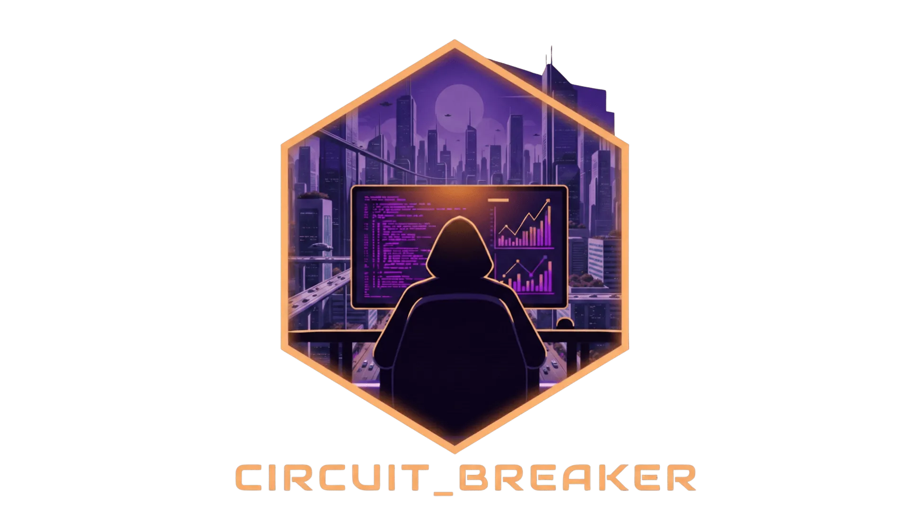

*Full dashboard in night mode — topology map, sidebar, and HUD panel*

---

## Topology Views

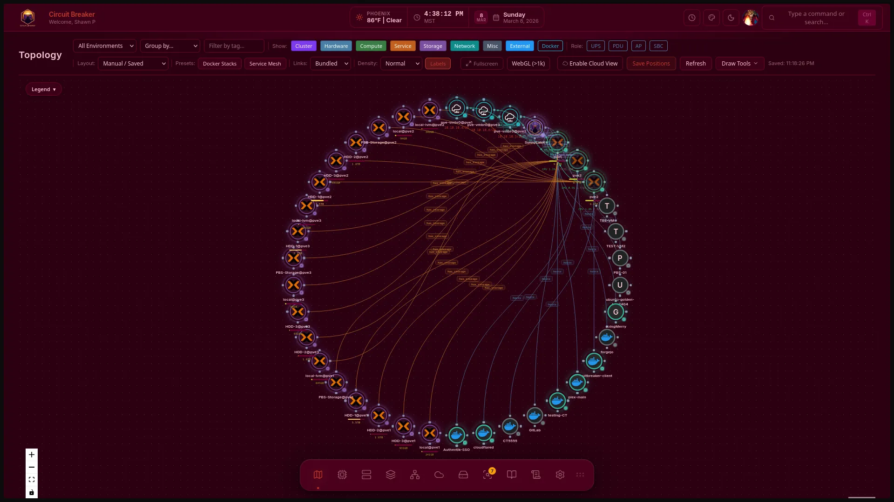

*Concentric rings layout with live connection animations*

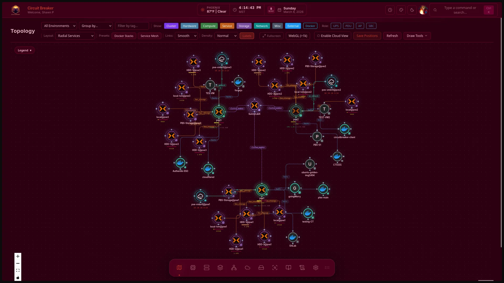

*Radial layout with smooth bundled connections*

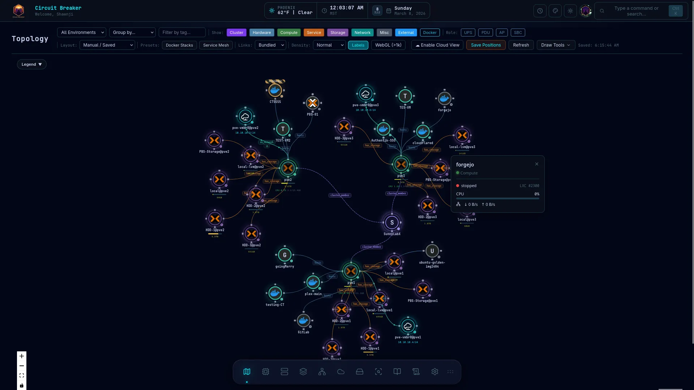

*Radial bundled topology — high-density infrastructure view*

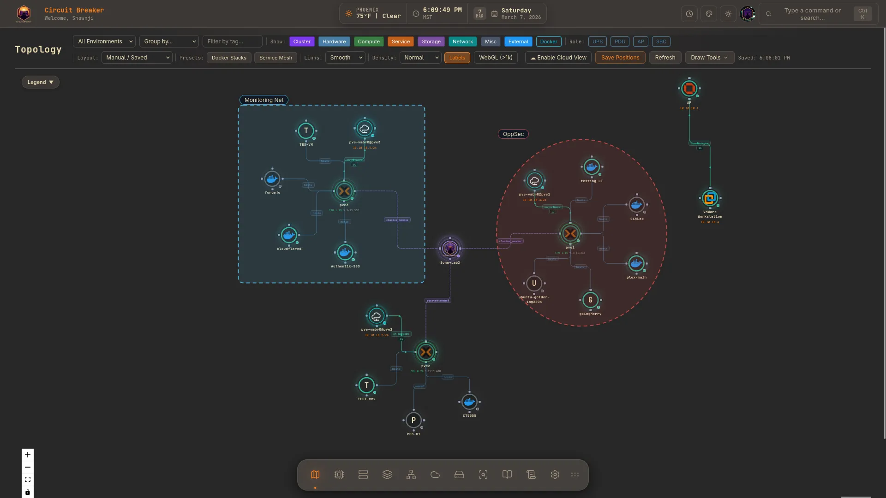

*Subnet-separated layout — nodes grouped by network segment*

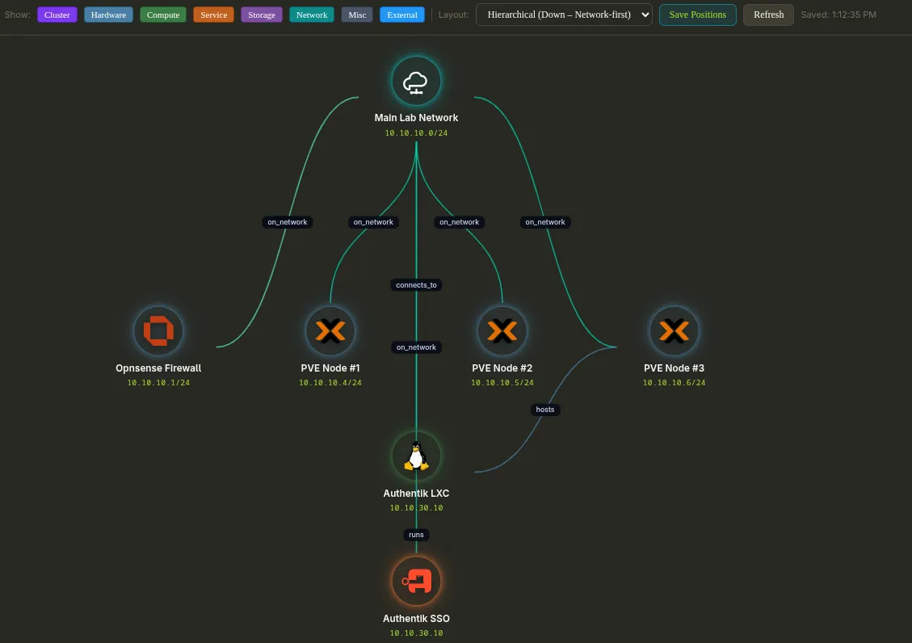

*Top-down hierarchical layout*

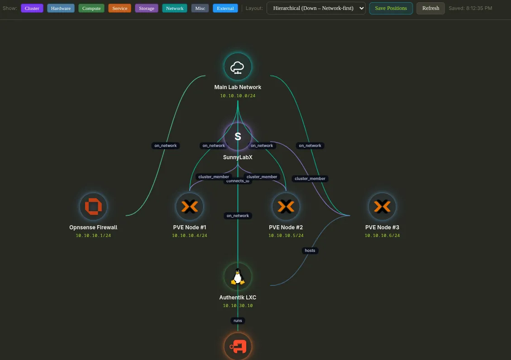

*Cluster layout — Proxmox nodes and VMs grouped visually*

*New map creation flow*

---

## HUD & Telemetry

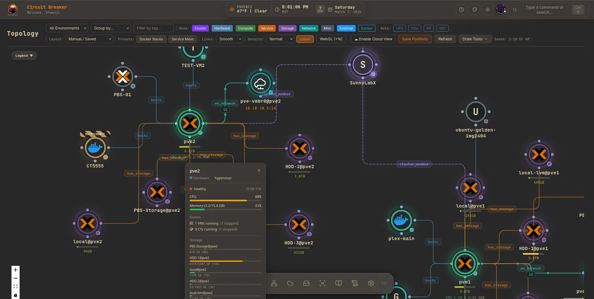

*Floating HUD with live iDRAC/iLO/SNMP telemetry badges*

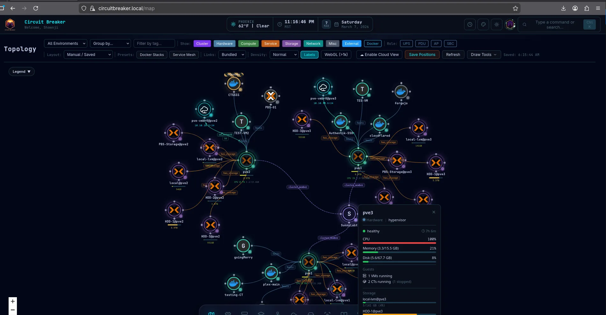

*HUD showing maintenance mode status indicators*

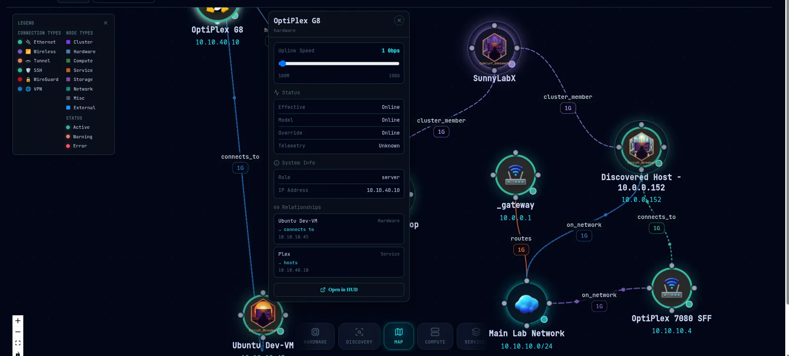

*Connection speed indicators on topology edges*

---

## Hardware & Discovery

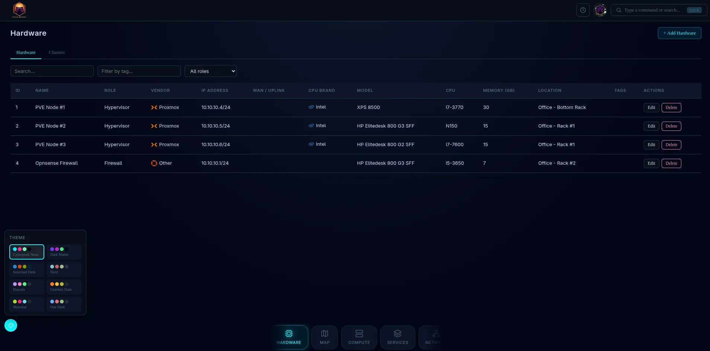

*Hardware inventory page with vendor catalog search and rack assignment*

---

## Mobile

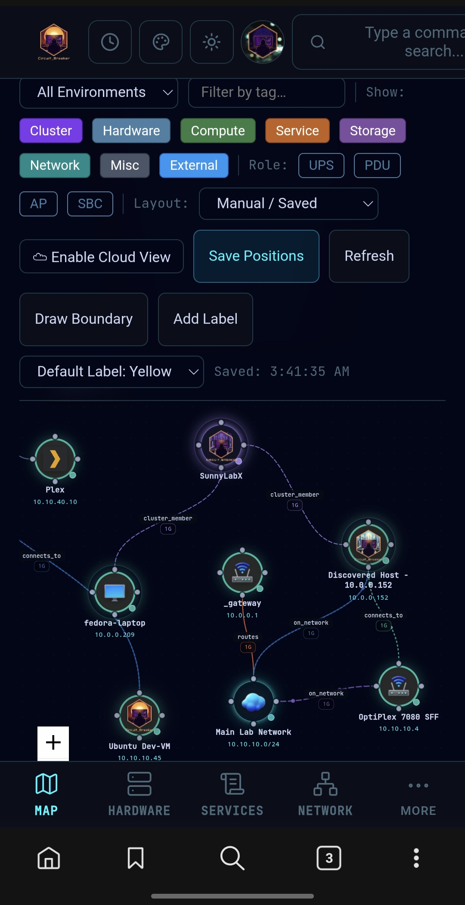

*Mobile-responsive topology layout*

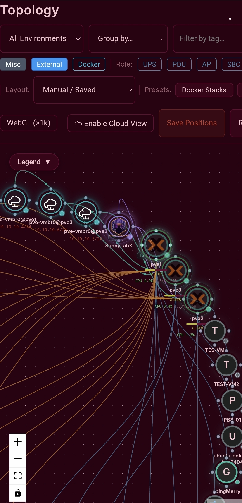

*Mobile HUD and controls*

---

## Authentication

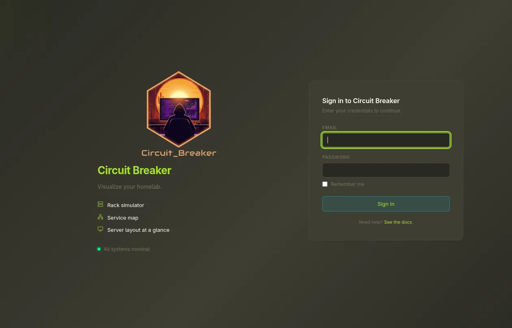

*Login page with OAuth/OIDC provider options*

---

## Audit Logs

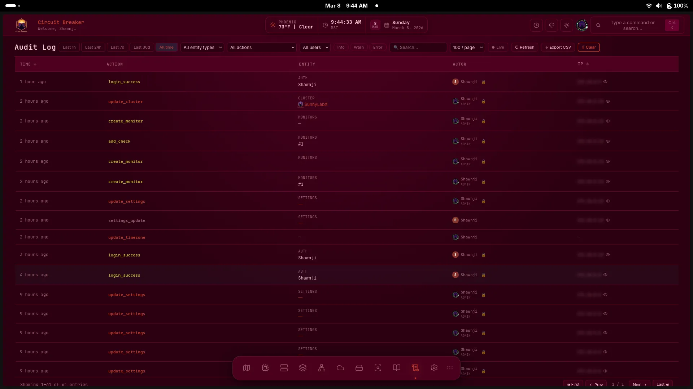

*Tamper-evident audit log with SHA-256 hash chain verification*
