# Circuit Breaker — Screenshot Gallery

📖 [Back to Docs Home](index.md) | 🌐 [User Guide](https://blkleg.github.io/CircuitBreaker/)

---

## Current release (0.4.6)

Captured against 0.4.6 in September 2026.

### Topology map

*The topology map: hardware, VMs, containers and services with live health and link speeds*

*Cortex rings: a compact hierarchy with clusters at the centre and storage and services around them*

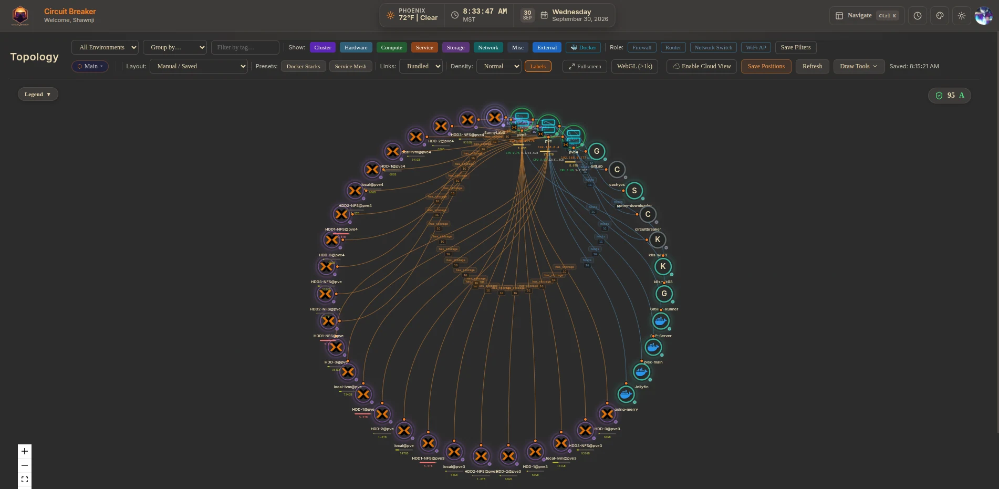

*Concentric rings*

*Force-directed*

*The map on a phone*

### Agents

*The agent fleet: online state, version, capabilities and live CPU, memory and network*

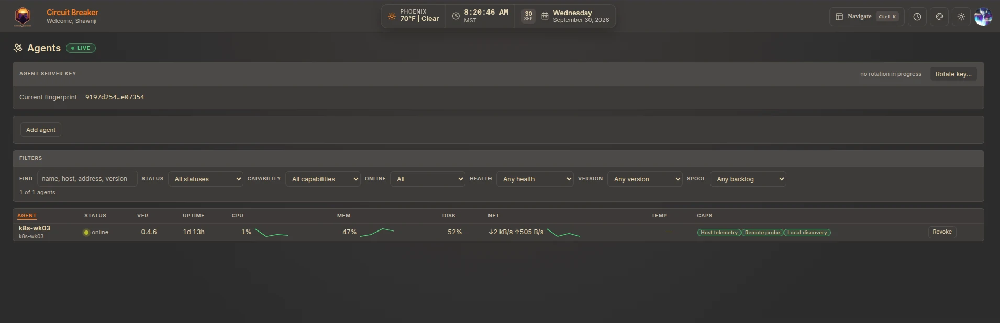

*The agents page, with the server key and the Add agent flow*

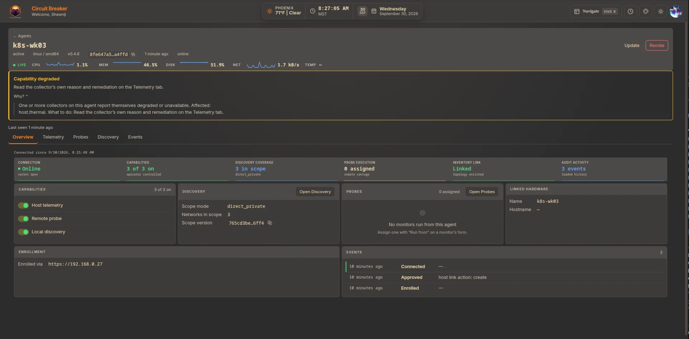

*One agent's overview: identity, capabilities, discovery scope and recent events*

*Host telemetry history from an agent*

*Discovery from inside the agent's own network, with the scope it is allowed to scan*

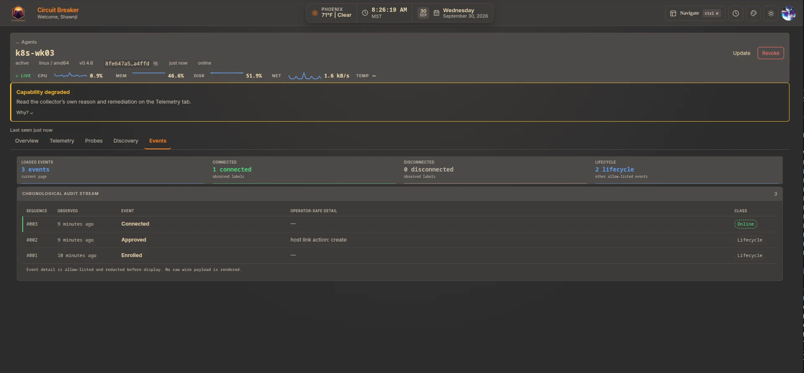

*The agent's connection and approval history*

### Inventory, logs and the CLI

*Compute units: VMs and containers with the hardware they run on*

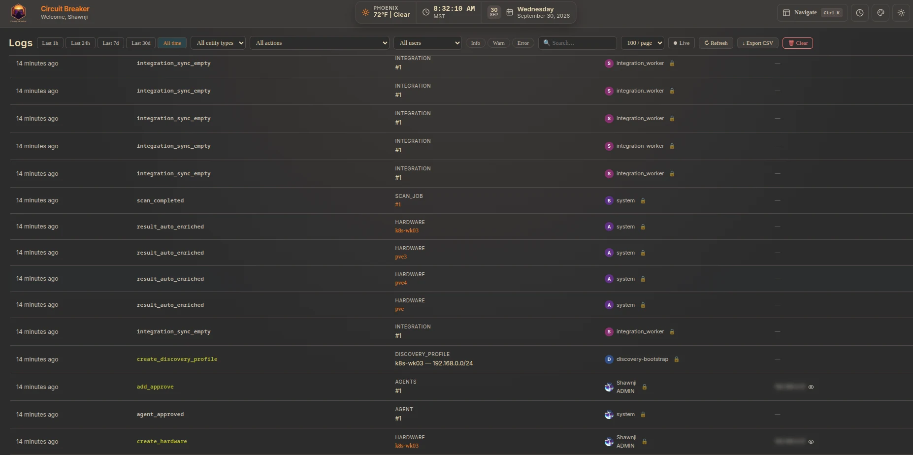

*The event log*

*`cb resources`: what the installation uses, per service, with its limits*

*The one-line installer*

---

## Earlier captures (0.2.x)

These predate the current UI and are kept for reference.

*Project artwork*

---

## Topology Views

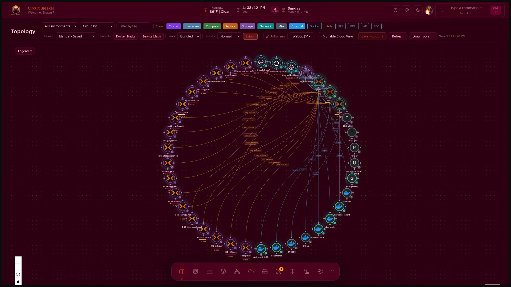

*Concentric rings layout with live connection animations*

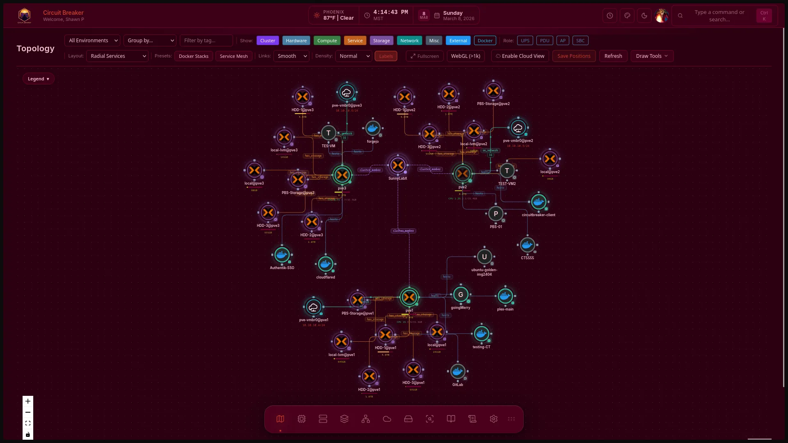

*Radial layout with smooth bundled connections*

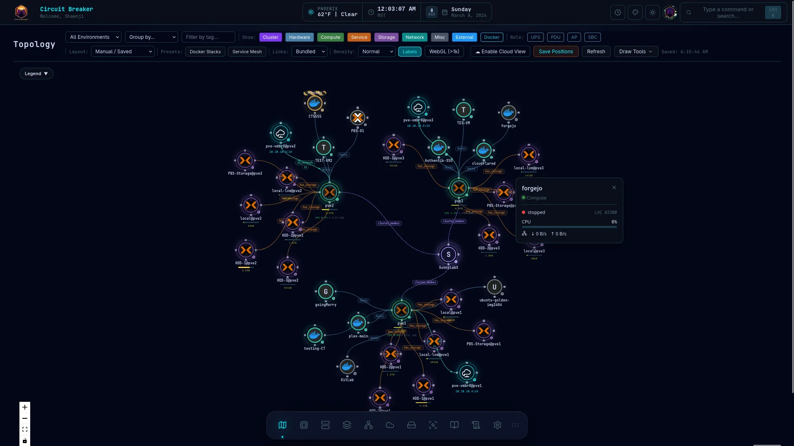

*Radial bundled topology — high-density infrastructure view*

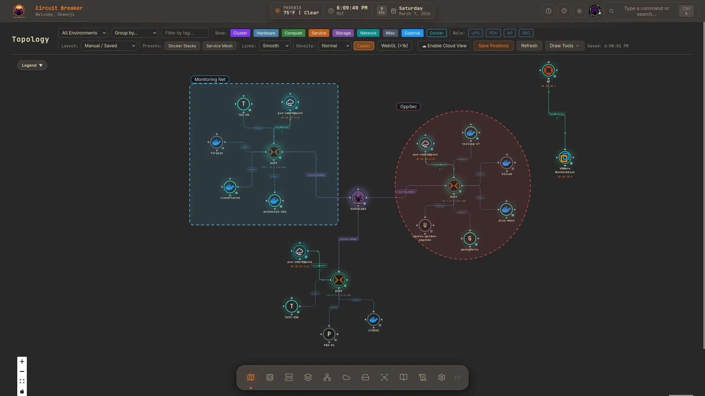

*Subnet-separated layout — nodes grouped by network segment*

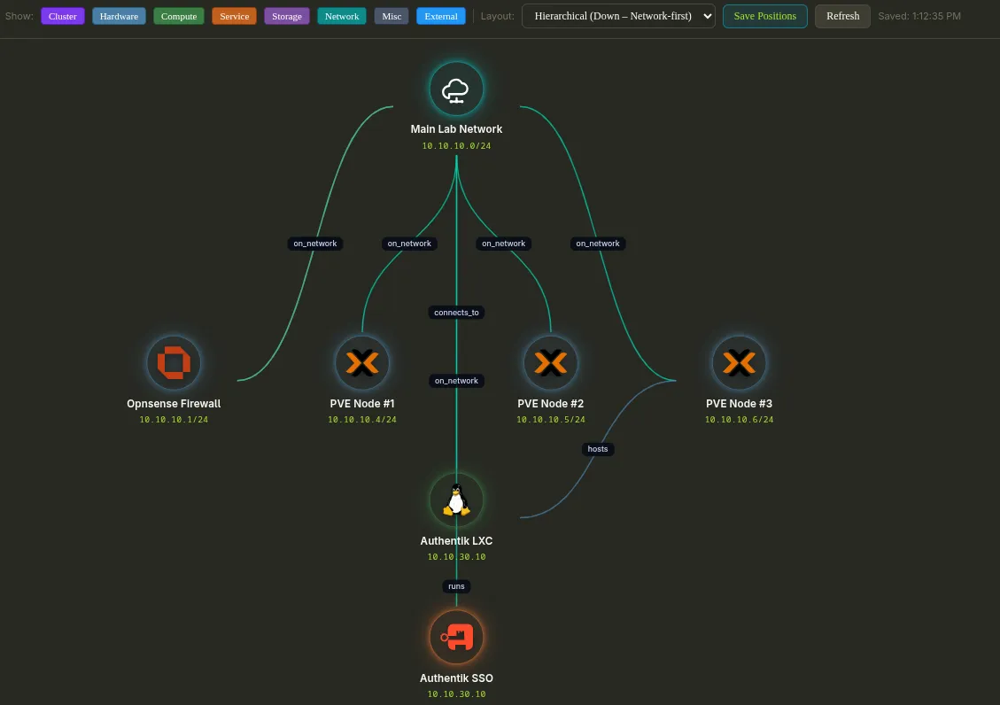

*Top-down hierarchical layout*

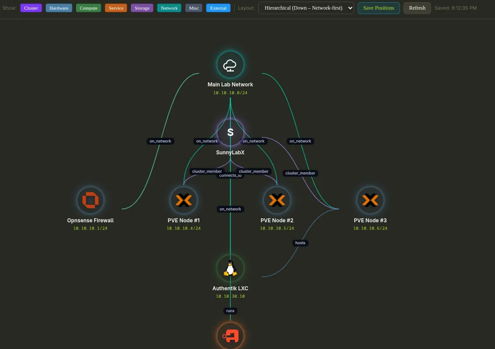

*Cluster layout — Proxmox nodes and VMs grouped visually*

*New map creation flow*

---

## HUD & Telemetry

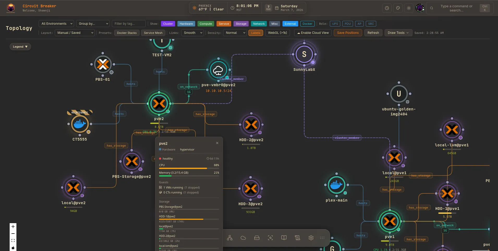

*Floating HUD with live iDRAC/iLO/SNMP telemetry badges*

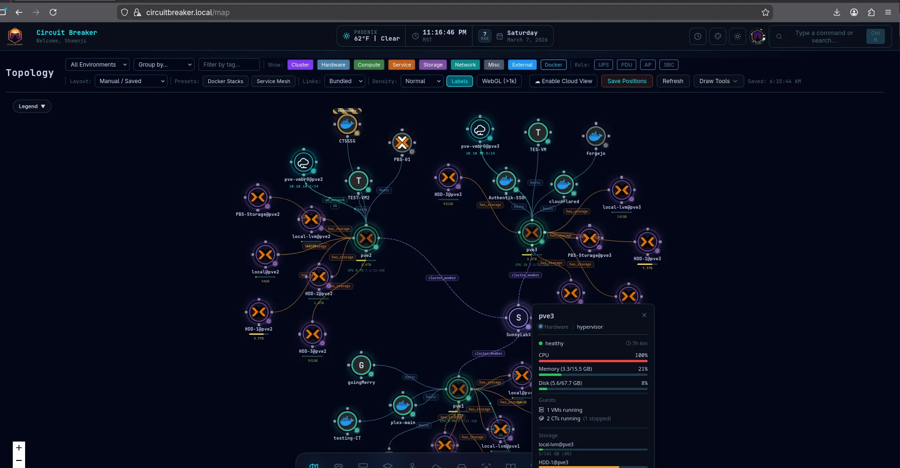

*HUD showing maintenance mode status indicators*

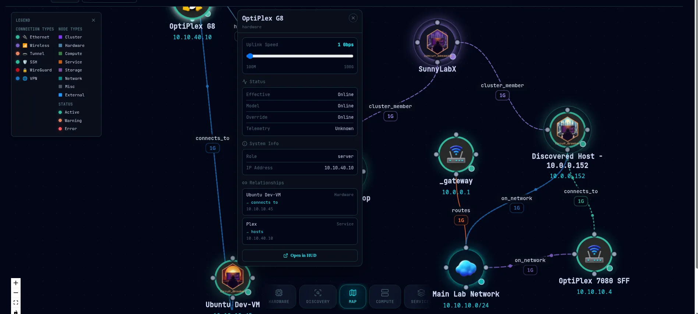

*Connection speed indicators on topology edges*

---

## Hardware & Discovery

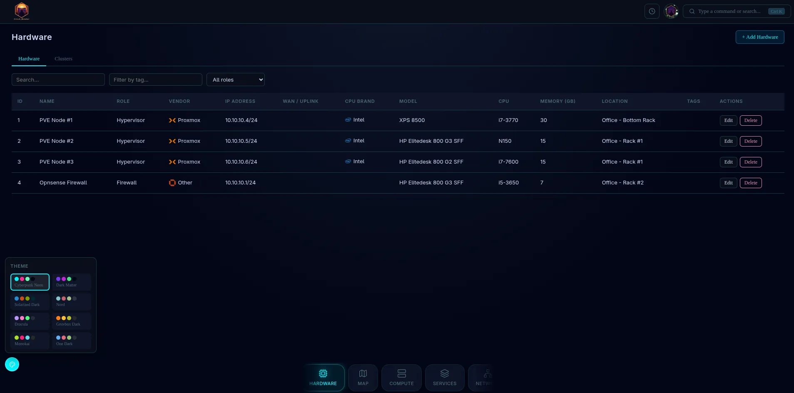

*Hardware inventory page with vendor catalog search and rack assignment*

---

## Mobile

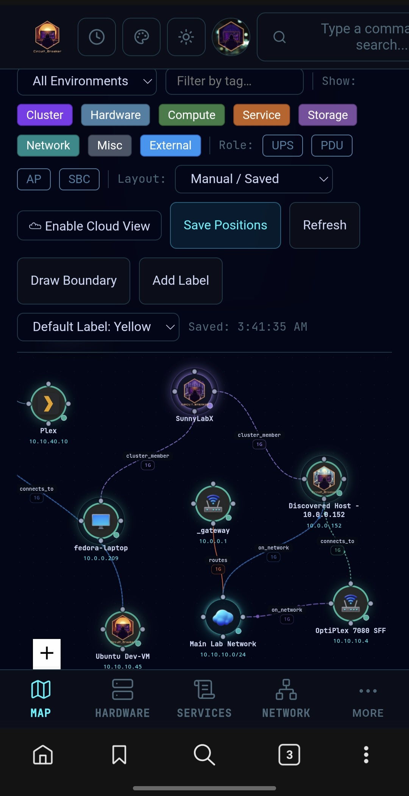

*Mobile-responsive topology layout*

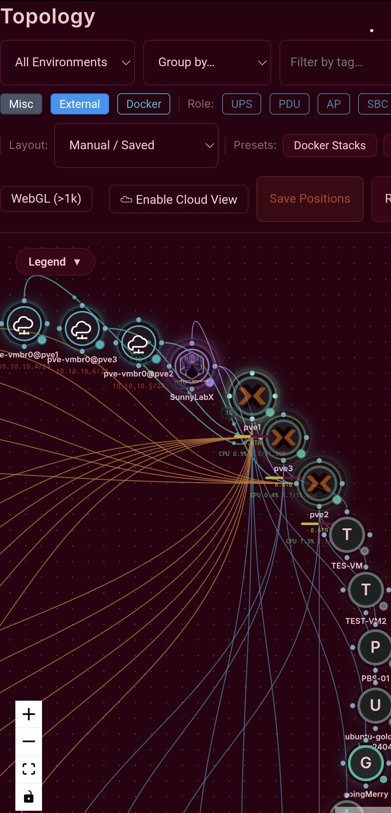

*Mobile HUD and controls*

---

## Authentication

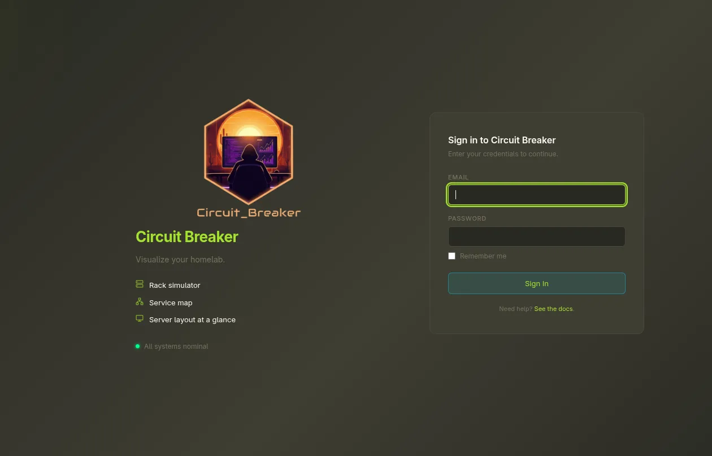

*Login page with OAuth/OIDC provider options*

---

## Audit Logs

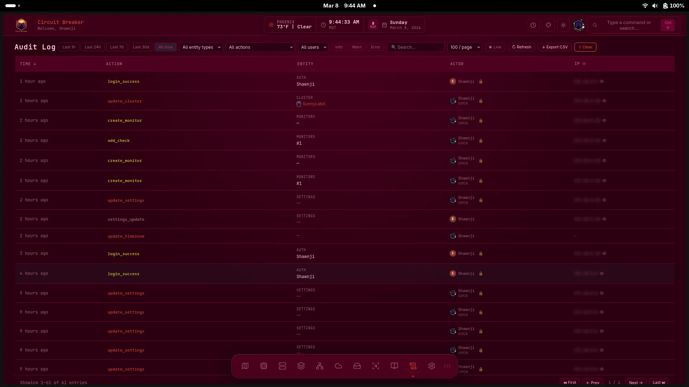

*Tamper-evident audit log with SHA-256 hash chain verification*
